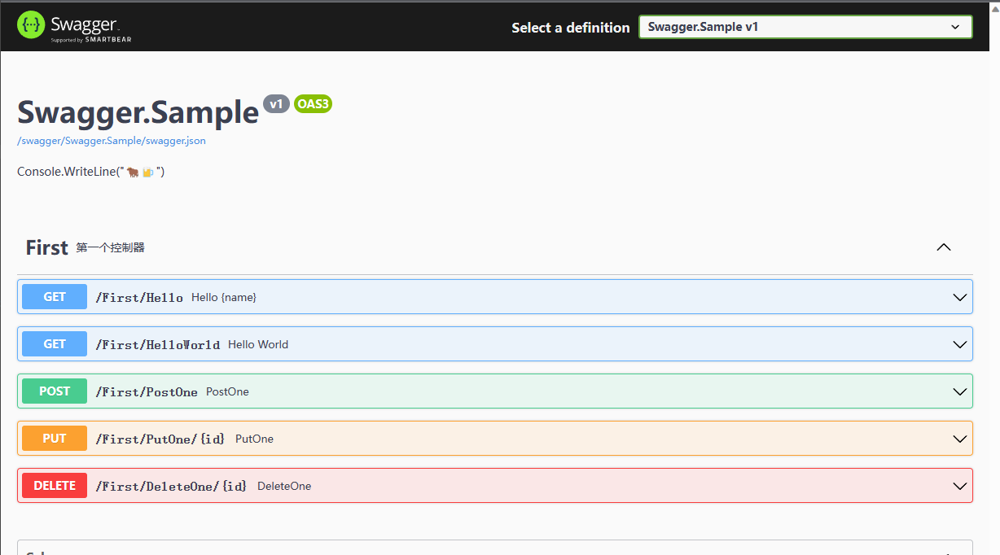
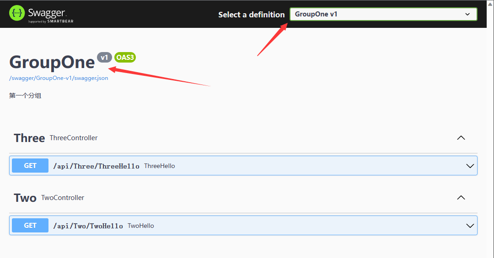
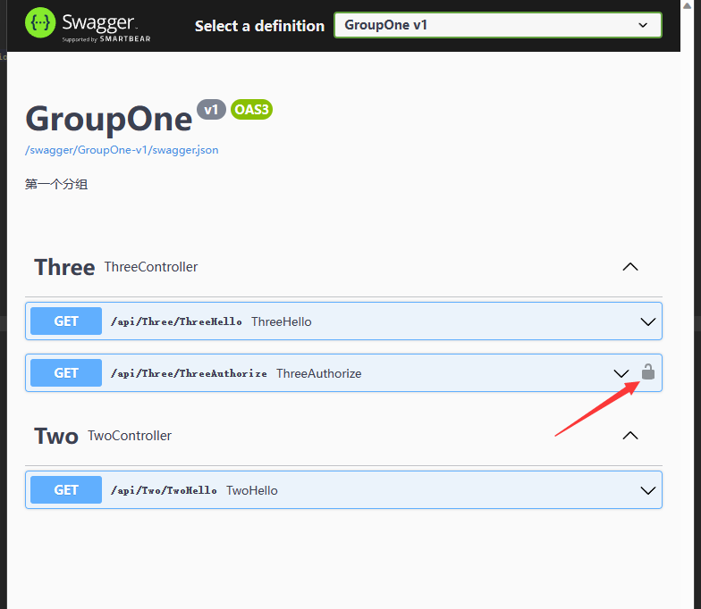
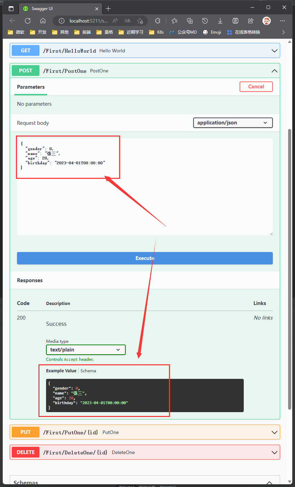

## 一文精通.NET Swagger 使用

> 在后端开发中,常用 Web API 模式,对外提供 RESTful API 让前端调用.而其中最著名的就是使用 Swagger(俗称:丝袜哥),Swagger 不但提供了非常直观的页面供开发者查看,还能配置注释说明,分组等,还可以直接在浏览器上测试接口,可以说是,现在不用 Swagger 的后端开发者不是个好开发者.本文将针对我在日常工作中使用 Swagger 的一些总结和例子,基本上属于复制代码就能用.

- 本文默认大家都有点基础,至少使用 VS 创建项目这些不用我再多说.
- 本文的例子使用微软默认的 Web API 模板进行构建,会详细的讲解每一步.并且会将代码上传到 GitHub.
- 本文会介绍 Swagger 的注释,接口分组,隐藏接口,以及给需要鉴权的接口添加标识.以及受支持的数据类型的默认值显示.
  - 注释不用说,就是将代码注释显示到页面上.
  - 接口分组可以实现将不同功能的控制器分到不同的组中,便于查看.
  - 隐藏接口则是将不希望对外公开的接口不显示,鉴权接口标识则是在 API 的后边显示一个 🔒 锁图标.
  - 显示默认值则是在某些数据中,比如用户年龄,默认显示 20,前端一看就知道这是个什么数据类型,当然这里的例子不太恰当,反正意思差不多.
- 最终呈现的效果大概就是如下,接下来就开始使用代码说明这一切.


- 首先使用 VS 创建一个 Web API 项目,这里我叫他 Swagger.Sample,你也可以叫他其他名字,随你自己.
- 默认的 AddSwaggerGen 配置代码里什么都没有,所以没有什么特殊的效果.仅仅只能查看接口和调试而已.

```csharp
var builder = WebApplication.CreateBuilder(args);

// Add services to the container.
builder.Services.AddControllers();
// Learn more about configuring Swagger/OpenAPI at https://aka.ms/aspnetcore/swashbuckle
builder.Services.AddEndpointsApiExplorer();
// 配置Swagger
builder.Services.AddSwaggerGen();
var app = builder.Build();

// Configure the HTTP request pipeline.
if (app.Environment.IsDevelopment())
{
    app.UseSwagger();
    app.UseSwaggerUI();
}
app.UseAuthorization();
app.MapControllers();
app.Run();
```

- 由于默认代码里有个天气数据接口,我们并不需要,所以删掉他们,并添加几个 POST,PUT,GET,DELETE 等接口来做例子,所有的接口均返回一个字符串.参数根据不同的接口类型,会声明不同的参数.但是都不会太复杂,大家肯定都能懂.
- 将默认的控制器改成如下这个样子.

```csharp
using Microsoft.AspNetCore.Mvc;

// ReSharper disable ClassNeverInstantiated.Global

namespace Swagger.Sample.Controllers;

/// <summary>
/// 第一个控制器
/// </summary>
[ApiController, Route("[controller]/[action]")]
public class FirstController : ControllerBase
{
    /// <summary>
    /// Hello {name}
    /// </summary>
    /// <param name="name"></param>
    /// <returns></returns>
    [HttpGet]
    public string Hello(string name) => $"Hello {name}";

    /// <summary>
    /// Hello World
    /// </summary>
    /// <returns></returns>
    [HttpGet]
    public string HelloWorld() => "Hello World";

    /// <summary>
    /// PostOne
    /// </summary>
    /// <param name="parameter"></param>
    /// <returns></returns>
    [HttpPost]
    public PostParameter PostOne(PostParameter parameter) => parameter;

    /// <summary>
    /// PutOne
    /// </summary>
    /// <param name="id"></param>
    /// <param name="put"></param>
    /// <returns></returns>
    [HttpPut("{id}")]
    public string PutOne(string id, PutParameter put) => $"update:{id},{put.Gender}";

    /// <summary>
    /// DeleteOne
    /// </summary>
    /// <param name="id"></param>
    /// <returns></returns>
    [HttpDelete("{id}")]
    public string DeleteOne(string id) => $"delete {id}";
}

/// <summary>
/// Put参数模拟
/// </summary>
public class PutParameter
{
    /// <summary>
    /// Gender
    /// </summary>
    public EGender Gender { get; set; }
}

/// <summary>
/// POST参数模拟
/// </summary>
public class PostParameter : PutParameter
{
    /// <summary>
    /// Name
    /// </summary>
    public string Name { get; set; } = string.Empty;

    /// <summary>
    /// Age
    /// </summary>
    public int Age { get; set; }
}

/// <summary>
/// 性别枚举
/// </summary>
public enum EGender
{
    /// <summary>
    /// 男
    /// </summary>
    男,

    /// <summary>
    /// 女
    /// </summary>
    女
}
```

- 上边搞了几个例子.启动后会发现按照预期显示页面.但是没有注释也没有上述别的功能.

### 添加文档注释

- 要让 Swagger 显示文档注释,首先要对项目添加 XML 文档生成.
- 打开项目的 xxx.csproj 我这里是 Swagger.Sample.csproj,在 PropertyGroup 节点下添加 GenerateDocumentationFile 为 Trune 如下内容:

```xml
  <PropertyGroup>
    <GenerateDocumentationFile>True</GenerateDocumentationFile>
  </PropertyGroup>
```

- 这时候启动项目,虽然会生成相应的文件,但是 Swagger 还是无法正常显示注释,其原因就是尚未对 Swaager 进行配置,这里我们先来添加文档注释显示.
- 打开 Program.cs 文件.若是进行过封装,可能会是其他文件,这里不做探讨,我们全部都在 Program.cs 中进行.
- 我们将代码改成如下形式

```csharp
var builder = WebApplication.CreateBuilder(args);

// Add services to the container.
builder.Services.AddControllers();
// Learn more about configuring Swagger/OpenAPI at https://aka.ms/aspnetcore/swashbuckle
builder.Services.AddEndpointsApiExplorer();
// 配置Swagger
builder.Services.AddSwaggerGen(c =>
{
    // 填写文档的一些属性,名称,版本和描述信息
    c.SwaggerDoc("Swagger.Sample", new()
    {
        Title = "Swagger.Sample",
        Version = "v1",
        Description = "Console.WriteLine(\"🐂🍺\")"
    });
    // 找到程序运行目录下的所有xml文件
    var files = Directory.GetFiles(AppContext.BaseDirectory, "*.xml");
    foreach (var file in files)
    {
        // 配置注释文档
        c.IncludeXmlComments(file, true);
    }
});
var app = builder.Build();

// Configure the HTTP request pipeline.
if (app.Environment.IsDevelopment())
{
    app.UseSwagger();
    app.UseSwaggerUI(c => c.SwaggerEndpoint("/swagger/Swagger.Sample/swagger.json", "Swagger.Sample v1"));
}
app.UseAuthorization();
app.MapControllers();
app.Run();
```

- 可见我们在 AddSwaggerGen 和 UseSwaggerUI 中都添加了一些配置,让 Swagger 可以找到对应的 XML 注释文件,这时候再重新运行程序,即可看到注释了.
- 这里的配置我们可以看到,不管是文档的名称还是 swagger.json 文件路径均是硬编码的,这方面后边的调整中会逐步调整,这里先不用在意.



- 到这里注释就基本添加完成,原理也懂了.

### 文档分组

- 文档分组我这里使用了一些特性,配合反射来获取分组信息.所以我们需要先创建一个工具类来帮助我们方便使用反射.
- 创建一个 Tool 文件夹,用来放一些扩展类.并新建我们的第一个(这个例子里应该也是最后一个)扩展类 AssemblyHelper.cs,并添加如下代码:

```csharp
using Microsoft.Extensions.DependencyModel;
using System.Reflection;
using System.Runtime.Loader;

namespace Swagger.Sample.Tools;

/// <summary>
/// 程序集帮助类
/// </summary>
// ReSharper disable once UnusedType.Global
public static class AssemblyHelper
{
    private static readonly string[] Filters = { "dotnet-", "Microsoft.", "mscorlib", "netstandard", "System", "Windows" };
    private static readonly IEnumerable<Assembly>? _allAssemblies;
    private static readonly IEnumerable<Type>? _allTypes;

    /// <summary>
    /// 需要排除的项目
    /// </summary>
    private static readonly List<string> FilterLibs = new();

    /// <summary>
    /// 构造函数
    /// </summary>
    static AssemblyHelper()
    {
        _allAssemblies = DependencyContext.Default?.GetDefaultAssemblyNames().Where(c => c.Name is not null && !Filters.Any(c.Name.StartsWith) && !FilterLibs.Any(c.Name.StartsWith)).Select(Assembly.Load);
        _allTypes = _allAssemblies?.SelectMany(c => c.GetTypes());
    }

    /// <summary>
    /// 添加排除项目,该排除项目可能会影响AutoDependenceInjection自动注入,请使用的时候自行测试.
    /// </summary>
    /// <param name="names"></param>
    public static void AddExcludeLibs(params string[] names) => FilterLibs.AddRangeIfNotContains(names);

    /// <summary>
    /// 根据程序集名字得到程序集
    /// </summary>
    /// <param name="assemblyNames"></param>
    /// <returns></returns>
    public static IEnumerable<Assembly> GetAssembliesByName(params string[] assemblyNames) => assemblyNames.Select(o => AssemblyLoadContext.Default.LoadFromAssemblyPath(Path.Combine(AppContext.BaseDirectory, $"{o}.dll")));

    /// <summary>
    /// 查找指定条件的类型
    /// </summary>
    public static IEnumerable<Type> FindTypes(Func<Type, bool> predicate) => _allTypes!.Where(predicate).ToArray();

    /// <summary>
    /// 查找所有指定特性标记的类型
    /// </summary>
    /// <typeparam name="TAttribute"></typeparam>
    /// <returns></returns>
    public static IEnumerable<Type> FindTypesByAttribute<TAttribute>() where TAttribute : Attribute => FindTypesByAttribute(typeof(TAttribute));

    /// <summary>
    /// 查找所有指定特性标记的类型
    /// </summary>
    /// <param name="type"></param>
    /// <returns></returns>
    public static IEnumerable<Type> FindTypesByAttribute(Type type) => _allTypes!.Where(a => a.IsDefined(type, true)).Distinct().ToArray();

    /// <summary>
    /// 查找指定条件的类型
    /// </summary>
    public static IEnumerable<Assembly> FindAllItems(Func<Assembly, bool> predicate) => _allAssemblies!.Where(predicate).ToArray();

    /// <summary>
    /// 添加不重复的元素
    /// </summary>
    /// <typeparam name="T"></typeparam>
    /// <param name="this"></param>
    /// <param name="values"></param>
    private static void AddRangeIfNotContains<T>(this ICollection<T> @this, params T[] values)
    {
        foreach (var obj in values)
        {
            if (@this.Contains(obj)) continue;
            @this.Add(obj);
        }
    }
}
```

- 写好帮助类后,即可新建一个特性用来承载我们的分组信息.
- 新建一个文件夹 Attributes 并添加 ApiGroupAttribute.cs,并写入如下代码:

```csharp
namespace Swagger.Sample.Attributes;

/// <summary>
/// 被此特性标记的控制器可在Swagger文档分组中发挥作用.
/// </summary>
[AttributeUsage(AttributeTargets.Class)]
// ReSharper disable once UnusedMember.Global
// ReSharper disable once UnusedType.Global
// ReSharper disable once ClassNeverInstantiated.Global
public sealed class ApiGroupAttribute : Attribute
{
    /// <summary>
    /// 构造函数
    /// </summary>
    /// <param name="title"></param>
    /// <param name="version"></param>
    /// <param name="description"></param>
    public ApiGroupAttribute(string title, string version, string description = "")
    {
        Title = title;
        Version = version;
        Description = description;
        Name = $"{title}-{version}";
    }

    /// <summary>
    /// Doc名称,$"{Title}-{Version}"格式
    /// </summary>
    public string Name { get; }

    /// <summary>
    /// 标题
    /// </summary>
    public string Title { get; }

    /// <summary>
    /// 版本
    /// </summary>
    public string Version { get; }

    /// <summary>
    /// 描述
    /// </summary>
    public string Description { get; }
}
```

- 其中各个字段的含义,均有注释.方便理解.这个时候我们准备工作就做好了,可以开始改造 Programe.cs 中的配置了.
- 首先创建几个局部变量,用来存储一些信息.

```csharp
// 文档标题
const string Title = "Test";                    // 文档标题
const string Version = "v1";                    // 版本
const string Name = $"{Title}-{Version}";       // 文档名称
Dictionary<string, string> docsDic = new();     // 用来存储文档分组的信息
Dictionary<string, string> endPointDic = new(); // 存储文档终结点json信息
```

- 然后修改 AddSwaggerGen 和 UseSwaggerUI 为如下内容:
- 为了方便,后期均会展示完整的 Programe.cs 代码

```csharp
using Swagger.Sample.Attributes;
using Swagger.Sample.Tools;
using System.Reflection;

var builder = WebApplication.CreateBuilder(args);

// Add services to the container.
builder.Services.AddControllers();
// Learn more about configuring Swagger/OpenAPI at https://aka.ms/aspnetcore/swashbuckle
builder.Services.AddEndpointsApiExplorer();

// 配置Swagger
const string Title = "Test";                    // 文档标题
const string Version = "v1";                    // 版本
const string Name = $"{Title}-{Version}";       // 文档名称
Dictionary<string, string> docsDic = new();     // 用来存储文档分组的信息
Dictionary<string, string> endPointDic = new(); // 存储文档终结点json信息
builder.Services.AddSwaggerGen(c =>
{
    // 配置默认分组
    c.SwaggerDoc(Name, new()
    {
        Title = Title,
        Version = Version,
        Description = "Console.WriteLine(\"🐂🍺\")"
    });
    // 配置文档注释
    var files = Directory.GetFiles(AppContext.BaseDirectory, "*.xml");
    foreach (var file in files)
    {
        c.IncludeXmlComments(file, true);
    }
    // 获取控制器分组信息和配置分组
    var controllers = AssemblyHelper.FindTypesByAttribute<ApiGroupAttribute>();
    foreach (var ctrl in controllers)
    {
        var attr = ctrl.GetCustomAttribute<ApiGroupAttribute>();
        if (attr is null) continue;
        if (docsDic.ContainsKey(attr.Name)) continue;
        _ = docsDic.TryAdd(attr.Name, attr.Description);
        c.SwaggerDoc(attr.Name, new()
        {
            Title = attr.Title,
            Version = attr.Version,
            Description = attr.Description
        });
    }
    c.DocInclusionPredicate((docName, apiDescription) =>
    {
        //反射拿到值
        var actionList = apiDescription.ActionDescriptor.EndpointMetadata.Where(x => x is ApiGroupAttribute).ToList();
        if (actionList.Count != 0)
        {
            return actionList.FirstOrDefault() is ApiGroupAttribute attr && attr.Name == docName;
        }
        //判断是否包含这个分组
        var not = apiDescription.ActionDescriptor.EndpointMetadata.Where(x => x is not ApiGroupAttribute).ToList();
        return not.Count != 0 && docName == Name;
    });
});
var app = builder.Build();

// Configure the HTTP request pipeline.
if (app.Environment.IsDevelopment())
{
    app.UseSwagger();
    app.UseSwaggerUI(c =>
    {
        // 默认分组
        c.SwaggerEndpoint($"/swagger/{Name}/swagger.json", $"{Title} {Version}");
        // 配置使用ApiGroupAttribute的分组
        var controllers = AssemblyHelper.FindTypesByAttribute<ApiGroupAttribute>();
        foreach (var ctrl in controllers)
        {
            var attr = ctrl.GetCustomAttribute<ApiGroupAttribute>();
            if (attr is null) continue;
            if (endPointDic.ContainsKey(attr.Name)) continue;
            _ = endPointDic.TryAdd(attr.Name, attr.Description);
            c.SwaggerEndpoint($"/swagger/{attr.Name}/swagger.json", $"{attr.Title} {attr.Version}");
        }
    });
}
app.UseAuthorization();
app.MapControllers();
app.Run();
```

- 这里分组的逻辑代码就已经完成了,我们再新建 TwoController 和 ThreeController 控制器来演示分组.

```csharp
/// <summary>
/// TwoController
/// </summary>
[Route("api/[controller]/[action]"), ApiController, ApiGroup("GroupOne", "v1", "第一个分组")]
public class TwoController : ControllerBase
{
    /// <summary>
    /// TwoHello
    /// </summary>
    /// <returns></returns>
    [HttpGet]
    public string TwoHello() => "Hello GroupOne";
}

/// <summary>
/// ThreeController
/// </summary>
[Route("api/[controller]/[action]"), ApiController, ApiGroup("GroupOne", "v1", "第一个分组")]
public class ThreeController : ControllerBase
{
    /// <summary>
    /// ThreeHello
    /// </summary>
    /// <returns></returns>
    [HttpGet]
    public string ThreeHello() => "Hello GroupOne";
}
```

- 可以看到我们分组成功后,选择 GroupOne 分组即可看到 Two 和 Three 控制器的 API 了.



### 为添加了 Authorize 特性的接口添加锁图标

- Authorize 为.NET 框架自带的一个特性.被他标记的接口,可以表示该接口需要 Token 校验通过才能访问.我们可以使用 OpenApiSecurityScheme 来为接口添加锁,不过这个方案有个缺点,会把所有的接口均加上锁,其实我们实际开发中有些接口是不需要的,虽然访问可能没有什么问题,但是这会给前端造成一些误解,比如登录接口有个锁.就会让人很懵 😵.为了避免这些不必要的误解.所以就有了这个需求,为只标记了 Authorize 特性的 API 添加锁图标.
- 在项目里新建一个文件夹 SwaggerFilters,存放我们的自定义的一些针对 Swagger 的 Filters.这里我们先创建第一个 SwaggerAuthorizeFilter.cs,并添加如下代码.

```csharp
/// <summary>
/// 在Swagger文档中给需要Authorize的接口添加🔒
/// </summary>
// ReSharper disable once UnusedMember.Global
// ReSharper disable once ClassNeverInstantiated.Global
public sealed class SwaggerAuthorizeFilter : IOperationFilter
{
    /// <summary>
    /// Apply
    /// </summary>
    /// <param name="operation"></param>
    /// <param name="context"></param>
    public void Apply(OpenApiOperation operation, OperationFilterContext context)
    {
        // 先筛选出包含Authorize特性的接口
        var authAttributes = context.MethodInfo.DeclaringType?.GetCustomAttributes(true)
                                    .Union(context.MethodInfo.GetCustomAttributes(true))
                                    .OfType<AuthorizeAttribute>();
        if (!authAttributes!.Any()) return;
        // 然后为其添加SecurityScheme
        // 由于项目中大部分使用的都是oauth2 Bearer Token认证所以这里默认以这种方式实现.别的方案请自行调整.
        operation.Security = new List<OpenApiSecurityRequirement>
        {
            new()
            {
                {
                    new()
                    {
                        Reference = new()
                        {
                            Type = ReferenceType.SecurityScheme,
                            Id = "Bearer"
                        },
                        Scheme = "oauth2",
                        Name = "Bearer",
                        In = ParameterLocation.Header
                    },
                    new List<string>()
                }
            }
        };
        operation.Responses.Add("401", new() { Description = "Unauthorized" });
    }
}
```

- 写好 Fillter 后事情就简单了.在 AddSwaggerGen 方法中添加一行代码即可.

```csharp
builder.Services.AddSwaggerGen(c =>
{
    ...
    c.DocInclusionPredicate((docName, apiDescription) =>
    {
        ...
    });
    c.OperationFilter<SwaggerAuthorizeFilter>(); // 为接口添加锁图标
});
```

- 接下来在 ThreeController 中新增一个接口来做验证.

```csharp
/// <summary>
/// ThreeAuthorize
/// </summary>
/// <returns></returns>
[HttpGet, Authorize]
public string ThreeAuthorize() => "Hello Authorize";
```

- 重新启动程序,即可发现添加了 Authorize 特性的接口已经加上了锁.



### 隐藏接口

- 有些场景下,我们希望某些接口是内部使用,不对外公开.甚至不需要让前端知道.这个时候我们就可以在 Swagger 里隐藏这种接口或者控制器.这样做的目的是为了降低前端工程师产生的误解,同时也可以将过时的接口隐藏起来,避免前端使用错误,虽然过时接口可以使用 Obsolete 特性来标记,但是他还是能在 Swagger 上看见.
- 为了隐藏接口,我们需要新建一个特性用来标记需要隐藏的接口或者控制器.
- 在 Attributes 文件夹中添加 HiddenApiAttribute.cs 并添加如下代码.

```csharp
/// <summary>
/// 被此特性标记的Action或者控制器可在Swagger文档中隐藏.
/// </summary>
[AttributeUsage(AttributeTargets.Class | AttributeTargets.Method)]
public sealed class HiddenApiAttribute : Attribute { }
```

- 同时还需要在 SwaggerFilters 文件夹中添加 SwaggerHiddenApiFilter.cs 来实现被标记接口隐藏.
- 其原理就是将被 HiddenApiAttribute 标记的接口从 SwaggerDoc 中移除来打到不显示的目的.

```csharp
/// <summary>
/// 在Swagger文档中隐藏接口
/// </summary>
// ReSharper disable once UnusedMember.Global
// ReSharper disable once ClassNeverInstantiated.Global
public sealed class SwaggerHiddenApiFilter : IDocumentFilter
{
    /// <summary>
    /// Apply
    /// </summary>
    /// <param name="swaggerDoc"></param>
    /// <param name="context"></param>
    public void Apply(OpenApiDocument swaggerDoc, DocumentFilterContext context)
    {
        foreach (var apiDescription in context.ApiDescriptions)
        {
#pragma warning disable IDE0048
            if (!apiDescription.TryGetMethodInfo(out var method) || !method.ReflectedType!.IsDefined(typeof(HiddenApiAttribute)) && !method.IsDefined(typeof(HiddenApiAttribute)))
#pragma warning restore IDE0048
                continue;
            var key = $"/{apiDescription.RelativePath}";
            if (key.Contains('?'))
            {
                var index = key.IndexOf("?", StringComparison.Ordinal);
                key = key[..index];
            }
            _ = swaggerDoc.Paths.Remove(key);
        }
    }
}
```

- 该过滤器的使用方法和前边的 SwaggerAuthorizeFilter 一样,只需要一行代码.

```csharp
builder.Services.AddSwaggerGen(c =>
{
    ...
    c.OperationFilter<SwaggerAuthorizeFilter>(); // 为接口添加锁图标
    c.DocumentFilter<SwaggerHiddenApiFilter>();  // 添加隐藏接口过滤
});
```

- 我们再在 ThreeController 中创建一个接口来验证该特性是否生效.

```csharp
/// <summary>
/// ThreeHidden
/// </summary>
/// <returns></returns>
[HttpGet, HiddenApi]
public string ThreeHidden() => "Hello Hidden";
```

- 重新启动程序后,我们会发现 ThreeHidden 并未显示在 Swagger 中说明我们成功了.这里就不再截图了.可以下载源码查看效果.
- 同样该特性可以作用于控制器,这样整个控制器中的接口均不会显示.

### 为参数添加默认值显示

- 目前感觉这个功能 Swagger 支持还不够完美,有一些类型的数据无法正常配置,不过后期会越来越完善的.
- 这里我们也是利用一个.NET 框架自带的特性 DefaultValue 来实现.不过同样需要自己写一个 Filter 才能实现这种功能.
- 首先我们在 SwaggerFilters 文件夹中新建一个 Filter,名字叫 SwaggerSchemaFilter.cs 并添加如下代码:

```csharp
/// <summary>
/// 添加默认值显示
/// </summary>
// ReSharper disable once UnusedMember.Global
// ReSharper disable once ClassNeverInstantiated.Global
public sealed class SwaggerSchemaFilter : ISchemaFilter
{
    /// <summary>
    /// Apply
    /// </summary>
    /// <param name="schema"></param>
    /// <param name="context"></param>
    public void Apply(OpenApiSchema schema, SchemaFilterContext context)
    {
        if (schema.Properties is null) return;
        foreach (var info in context.Type.GetProperties())
        {
            // Look for class attributes that have been decorated with "[DefaultAttribute(...)]".
            var defaultAttribute = info.GetCustomAttribute<DefaultValueAttribute>();
            if (defaultAttribute is null) continue;
            foreach (var property in schema.Properties)
            {
                // Only assign default value to the proper element.
                if (ToCamelCase(info.Name) != property.Key) continue;
                property.Value.Example = defaultAttribute.Value as IOpenApiAny;
                break;
            }
        }
    }

    /// <summary>
    /// 转成驼峰形式,这里需要注意一下,可能需要按照你自己的字段规范进行自定义转换,不然对不上.
    /// </summary>
    /// <param name="name"></param>
    /// <returns></returns>
    private static string ToCamelCase(string name) => char.ToLowerInvariant(name[0]) + name[1..];
}
```

- 其中 ToCamelCase 方法需要注意一下,我们使用默认的驼峰形式来表示 JSON 字段,所以这里若是不一样,需要自己处理一下.
- 接下来在 Program.cs 中配置 SwaggerSchemaFilter.

```csharp
builder.Services.AddSwaggerGen(c =>
{
    ...
    c.DocumentFilter<SwaggerHiddenApiFilter>();  // 添加隐藏接口过滤
    c.SchemaFilter<SwaggerSchemaFilter>();       // 添加默认值显示
});
```

- 这一切都做好了后,现在回到 FirstController.cs 中,将 PostParameter 类调整下,为了直观点,我加了一个新的对象.并调整成如下代码:

```csharp
/// <summary>
/// POST参数模拟
/// </summary>
public class PostParameter : PutParameter
{
    /// <summary>
    /// Name
    /// </summary>
    [DefaultValue("张三")]
    public string Name { get; set; } = string.Empty;

    /// <summary>
    /// Age
    /// </summary>
    [DefaultValue(20)]
    public int Age { get; set; }

    /// <summary>
    /// 生日
    /// </summary>
    [DefaultValue(typeof(DateTime), "2023-04-01")]
    public DateTime Birthday { get; set; } = DateTime.Now;
}
```

- 在上述例子中,我给 Name 字段添加了默认值:张三,Age 添加了默认值 20,新增 Birthday 字段并设置默认值为 23 年愚人节.
- DefaultValue 特性第一个参数为数据类型,提供了几个默认的重载,若是没有的话,可以使用 typeof 来指定类型,并用字符串的形式设置默认值显示.
- 做好这一切后,启动程序,来观察默认值是否设置成功.



- 可以看到这一切均按照我们的预期实现.
- 到这里我在工作中使用的功能已经介绍完,若是你有其他的玩法,请提供 PR😁 或者告诉我一起研究.
- [源码已上传至 GitHub](https://github.com/joesdu/Swagger.Sample)

- 以上功能同样在我的库中已经预定义.可以参考[EasilyNET.WebCore](https://www.nuget.org/packages/EasilyNET.WebCore)
- [EasilyNET](https://github.com/EasilyNET/EasilyNET)

- [本文 GitHub 链接](https://github.com/EasilyNET/docs)
