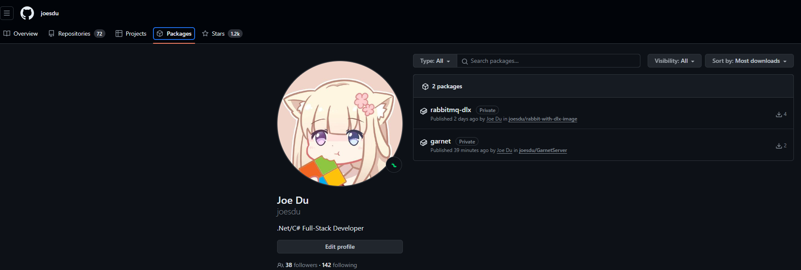

### 利用 Github CI 和 Packages 构建并托管我们的容器镜像

最近找到了新工作,很久没有更新公众号内容了,刚好迎来 51,休息了几天,最后一天打算写点东西.刚好也发现了 GitHub 竟然也有镜像托管服务,这还是很香的,也不用自己利用 Harbor 来托管镜像了,虽然私有镜像的空间有限,但是公开的镜像却没有任何限制.这里就不得不吐槽下腾讯云的镜像服务了.

> 刚好最近在维护自己的一个 RabbitMQ 镜像,由于我的库在使用 rabbitmq-delayed-exchange 插件,官方的镜像没有这个插件,每次都手动复制安装的话难免有点麻烦,所以创建了一个仓库用来自己生成镜像.

- 仓库很简单,仅仅对官方的镜像添加了 delayed-exchange 插件.写了个脚本用来构建镜像.
- 详细内容可以查看仓库: https://github.com/joesdu/rabbit-with-dlx-image

> 当然程序员就是懒,能让计算机干的事情,若是每次都自己手动来干,那也太累了.所以还是将构建镜像的操作交给自动化流程.在 GitHub 中叫 GitHub Actions.

#### 添加 GitHub Actions 的配置文件

- 首先在仓库中新增 .github/workflows 文件夹,并在文件夹中新增一个 yml 文件,这里我就叫 docker-publish.yml 了.文件内容如下:

```yml
name: Publish Container Image
# 当每次发布版本的时候便启动工作流
on:
  push:
    tags: ["*.*.*"]
env:
  TZ: Asia/Shanghai
jobs:
  build:
    runs-on: ubuntu-latest
    permissions:
      contents: read
      packages: write
      id-token: write
    steps:
      - name: Checkout repository
        uses: actions/checkout@v4
      - name: Set up Docker Buildx
        uses: docker/setup-buildx-action@v3.3.0
      - name: Log into registry ghcr.io
        if: github.event_name != 'pull_request'
        uses: docker/login-action@v3.1.0
        with:
          registry: ghcr.io
          username: ${{ github.actor }}
          password: ${{ secrets.GHPACKAGE_TOKEN }}
      - name: Log into DockerHub
        if: github.event_name != 'pull_request'
        uses: docker/login-action@v3.1.0
        with:
          username: ${{ secrets.DOCKERHUB_USER }}
          password: ${{ secrets.DOCKERHUB_TOKEN }}
      - name: Build and push Docker image
        if: github.event_name != 'pull_request'
        run: ./build.ps1
        shell: pwsh
```

- 上面的 yml 文件中可以看到用到了几个 secrets,这些需要去 GitHub 的 Settings 以及 Docker Hub 的设置中进行添加 Token 用于账户的登录授权.创建方法这里不做过多的解释.可以查看 GitHub Actions 的文档这也属于 GitHub 的基础操作之一.
- 在这个工作流程中我们其实就干了这几件事情

  1. 拉取仓库源代码
  1. 设置 Docker Buildx 环境
  1. 登录 GitHub 容器镜像服务
  1. 登录 Docker Hub 的服务
  1. 构建镜像并推送到仓库

- 可见最后的一个步骤中我们运行了自己的脚本 build.ps1.而这个脚本中正是我们构建镜像的关键,当然也可以将命令直接运行而不使用脚本,其实都一样的效果.

```powershell
$base = "dygood/" ;
$name = "rabbitmq-dlx" ;
# 构建 latest
$tag = ":latest" ;
$imagename = $base + $name + $tag ;
$imagename ;
docker buildx create --use ;
docker buildx build --platform linux/amd64,linux/arm64,linux/arm/v7,linux/ppc64le,linux/s390x -t $imagename . --progress plain --push ;
$gh = "ghcr.io/joesdu/";
$ghimagename = $gh + $name + $tag ;
$ghimagename;
docker buildx build --platform linux/amd64,linux/arm64,linux/arm/v7,linux/ppc64le,linux/s390x -t $ghimagename . --progress plain --push ;
```

- 从上面的脚本中我分别构建了两个名称的镜像一个用于推送到 Docker Hub 一个用于推送到今天的主角 Github Packages 中.
- RabbitMQ 是支持多平台的,所以这里我们也支持了 AMD64,ARM64,ARM v7,PPC64LE,S390X 等平台,虽然有些没听过,但也跟着官方的支持平台同时支持了.
- 构建的工具使用了 docker buildx 而不是直接使用 docker build 是因为我们需要支持多平台,但是在 x64 的计算机上,只能使用这个来构建多平台的镜像.

#### 配置 Packages 使其与代码仓库关联

> 通过上面的操作,其实我们的镜像已经推送到 GitHub Packages 服务中.可以在我们的个人主页的 Packages 选项卡中看到
> 

我们可以点击名称进入到详细信息页面,但是并没有任何介绍,我们可以点击页面上的关联到代码仓库的按钮来进行关联,关联后代码的 readme 内容则会加载到镜像的介绍中,简直是不要太方便.

- 到这里,整个流程就已经完成,接下来就可以使用 GitHub 托管的容器镜像了,免去了复杂的构建流程,我们只需要更新代码即可创建好镜像并打包推送到镜像仓库.

- 在该例子完成后,我还创建了,garnet 的镜像.所以我们可以使用如下的命令快速在本地或者服务器上开启服务.

- 使用 RabbitMQ with dlx

```bash
docker run --name rabbitmq -p 5672:5672 -p 15672:15672 -d --rm -it -e RABBITMQ_DEFAULT_USER=guest -e RABBITMQ_DEFAULT_PASS=guest ghcr.io/joesdu/rabbitmq-dlx:latest
```

- 使用 Garnet

```bash
docker run --name garnet -p 3278:3278 -d --rm -it -e TZ=Asia/Chongqing ghcr.io/joesdu/garnet:latest
```

- 代码仓库中也提供了 Docker Conmpose 的使用例子,有兴趣的可以去我的主页查看
- GitHub 主页: https://github.com/joesdu
