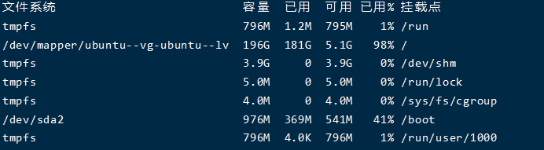
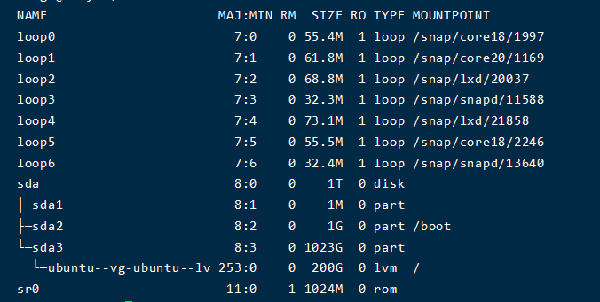
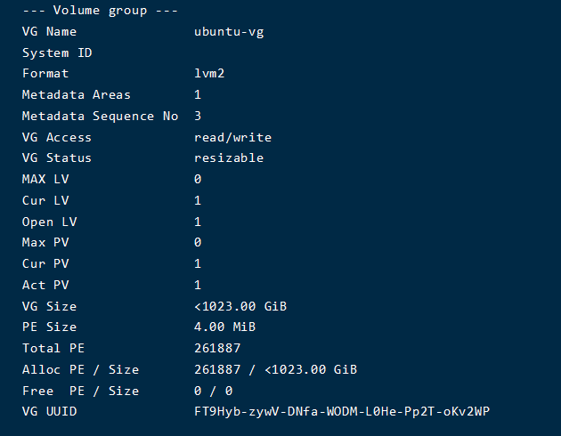
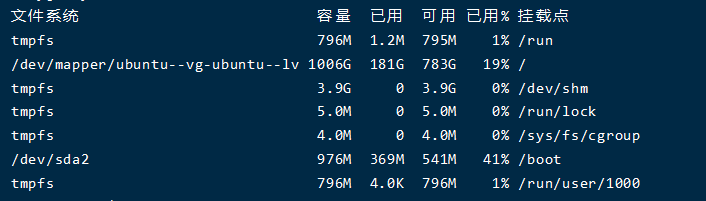

##### 背景

使用 ESXI 装好 Ubuntu 系统后,系统默认使用了 200G 空间(分配的虚拟磁盘大于该值),造成分配的虚拟磁盘未全部挂载到根目录,使用久了,就出现磁盘空间不足,特别是使用数据库备份的服务器,大量的备份导致磁盘很快就爆满了.
所以我们这里需要将未使用的空间全部分配上.
以前安装 Linux 按照传统的分区方式,选择 custom,可以给磁盘划分出 sda1,sda2...
这些在 Linux 里称之为分区 partition,然后分别把/,/home,/var 等挂载到各个分区
但是随着 LVM 技术的推广,现在安装 Ubuntu 如果采用默认的格式化整个磁盘的方式来安装,安装完成后发现磁盘空间没有占满,/(根目录)挂载只占用了 200 多 G.造成严重浪费.

表现如下:

```bash
df -h
```



- 使用 lsblk 命令查看磁盘信息

```bash
lsblk
```


可以看到实际分配的虚拟磁盘空间为 1T,但是实际使用了 200G

- 原因是由于这里没有直接挂载在物理分区上,而是把/挂载在了逻辑分区 LVM 文件系统上,而这里显示的/dev/mapper/ubuntu--vg-ubuntu--lv,这是一块逻辑分区文件!它本身只有 200G.那理所当然挂载在它之上的/最多就是 200G.
- 要扩展/我们就扩展这个 LVM 文件,很简单,执行如下命令,让他占满磁盘剩余空间.

```bash
sudo lvextend -l +100%FREE /dev/mapper/ubuntu--vg-ubuntu--lv
```

- 若是无需分配所有磁盘空间,可以按需分配执行如下命令:

```bash
sudo lvextend -L 50G /dev/mapper/ubuntu--vg-ubuntu--lv
```

- 该命令扩充 50G,其他大小按自己需求调整,当然,无法大于实际可使用的剩余空间
- 执行完上述命令后,需要重新计算磁盘大小.

```bash
sudo resize2fs /dev/mapper/ubuntu--vg-ubuntu--lv
```

- 等待数秒.执行完成后即可查看磁盘信息

```bash
sudo vgdisplay
```



- 再次使用 df -h 命令查看磁盘信息就可以看到所有空间均已挂载

```bash
df -h
```



#### 二次扩容

由于一些原因,原有的磁盘空间可能不足,需要再次进行扩充容量.
我们先将服务器关机,然后在 ESXi 中编辑服务器的磁盘大小为最终想要的大小.保存后开机.

- 先使用命令查看新增的磁盘容量是否上线.

```shell
sudo fdisk -l
```
- 可能会出现什么GPT格式问题
```shell
sudo parted -l
```

- 扩展分区 这里依据实际情况

```shell
sudo fdisk /dev/sda 
```

- 根据提示大概是依次输入 n , p ,w 即可成功创建分区.
- 加载分区表

```shell
sudo partprobe
```

- 使用 lsblk 命令查看磁盘信息,我这里可以看到新增的磁盘是/dev/sda4

```bash
lsblk
```

- 扩展 VG

```shell
sudo pvcreate /dev/sda4
```

- 查看 vgs 然后把 sda4 加入到 LVM 组中

```shell
sudo vgs
```

输出内容如下,这里我们会用到 VG 的名称,不同系统可能不太一样.需要注意.

```
VG        #PV #LV #SN Attr   VSize    VFree
ubuntu-vg   1   1   0 wz--n- <199.00g    0
```

```shell
sudo vgextend ubuntu-vg /dev/sda4
```

- 扩展 LV(其中 mapper 后边的名称需要根据实际情况来,不同的系统应该不一样.)

```shell
sudo lvextend /dev/mapper/ubuntu--vg-ubuntu--lv /dev/sda4
```

- 扩展磁盘占用所有空间并重新计算

```shell
sudo lvextend -l +100%FREE /dev/mapper/ubuntu--vg-ubuntu--lv
sudo resize2fs /dev/mapper/ubuntu--vg-ubuntu--lv
```

- 查看容量

```shell
sudo df -h
```
