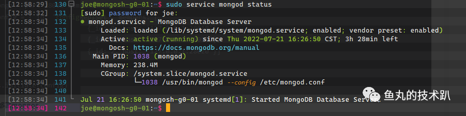

> MongoDB 的分片集群可以实现水平横向扩展,自己简单测试了下.性能简直是炸裂.

- 首先准备一批服务器.(理论上来讲 mongos 需要多节点高可用,但是家境贫寒,先弄一个节点)

| 名称           | vCPU | RAM | ROM | 数据磁盘 | IP           | 用途                 |
| -------------- | ---- | --- | --- | -------- | ------------ | -------------------- |
| mongos-01      | 16   | 32  | 50  | 0        | 192.168.2.60 | 对外提供 mongos 服务 |
| mongocs-01     | 2    | 4   | 50  | 0        | 192.168.2.61 | mongoconfig 服务 1   |
| mongocs-02     | 2    | 4   | 50  | 0        | 192.168.2.62 | mongoconfig 服务 2   |
| mongocs-03     | 1    | 2   | 50  | 0        | 192.168.2.63 | mongoconfig 服务 3   |
| mongosh-g0-01  | 4    | 8   | 40  | 200      | 192.168.2.64 | 分片 1 主节点        |
| mongosh-g0-02  | 4    | 8   | 40  | 200      | 192.168.2.65 | 分片 1 从节点        |
| mongosh-g0-arb | 1    | 1   | 40  | 0        | 192.168.2.66 | 分片 1 仲裁节点      |
| mongosh-g1-01  | 4    | 8   | 40  | 200      | 192.168.2.67 | 分片 2 主节点        |
| mongosh-g1-02  | 4    | 8   | 40  | 200      | 192.168.2.68 | 分片 2 从节点        |
| mongosh-g1-arb | 1    | 1   | 40  | 0        | 192.168.2.69 | 分片 2 仲裁节点      |

- 以上就是服务器的规划.不多不少正好 10 台.(做集群真的是有点费 🤣)
- 给 10 台服务器均装好操作系统 Ubuntu20.04LTS(目前 MongoDB 6.x 支持的最新版本,21.10 也可以)
- 接下来先走一波常规的 MongoDB 安装步骤,也可以参考副本集集群中的安装步骤.
- 首先常规操作,安装必须的依赖包.

```bash
sudo apt install gnupg
```

- 导入 GPG 公钥

```bash
wget -qO - https://www.mongodb.org/static/pgp/server-6.0.asc | sudo apt-key add -
```

- 创建 MongoDB 的包源文件

```bash
echo "deb [ arch=amd64,arm64 ] https://repo.mongodb.org/apt/ubuntu focal/mongodb-org/6.0 multiverse" | sudo tee /etc/apt/sources.list.d/mongodb-org-6.0.list
```

- 执行包源更新和安装 mongodb 社区版

```bash
sudo apt update && sudo apt install mongodb-org -y
```

- 到此 MongoDB 的包就装好了.接下来就是调整配置文件的部分了.
- 首先先做两个 shard 节点的配置.
- 我们可以先生成一个 keyFile 用来节点间校验通信,并同步到所有节点的用户目录下.

```bash
openssl rand -base64 745 > /home/joe/mongokeyfile.key
# 同时还调整keyFile的所有者和只读权限.并同步到其他所有机器
sudo chown mongodb:mongodb /home/joe/mongokeyfile.key && sudo chmod 400 /home/joe/mongokeyfile.key
```

- 修改 mongod.conf 配置文件

```bash
sudo nano /etc/mongod.conf
```

- 192.168.2.64 - 192.168.2.66 这三个节点我们当作 shard1.其配置如下.

```conf
# mongod.conf
# for documentation of all options, see:
#   http://docs.mongodb.org/manual/reference/configuration-options/

# Where and how to store data.
storage:
  dbPath: /mongo
  journal:
    enabled: true
#  engine:
#  wiredTiger:

# where to write logging data.
systemLog:
  destination: file
  logAppend: true
  path: /mongo/logs/mongod.log

# network interfaces
net:
  port: 27017
  bindIp: 0.0.0.0

# how the process runs
processManagement:
  timeZoneInfo: /usr/share/zoneinfo

#security:
security:
  keyFile: /home/joe/mongokeyfile.key
  authorization: enabled

#operationProfiling:

replication:
  replSetName: sh1

sharding:
  clusterRole: shardsvr

## Enterprise-Only Options:

#auditLog:

#snmp:
```

- 可见我们的配置文件中启用了安全校验,若是出现第一次无法使用 mongosh 登录,可先注释掉 authorization: enabled 等待配置好用户后再开启,shard2 也是如此.修改配置文件后,mongod 服务需要重启一下.
- 这里我们需要注意一下一些参数,其中 dbPath 我单独放到了用于数据库使用的磁盘中.所以路径和默认的不一致.
- 仲裁节点由于不保存数据,所以可以不调整配置文件内容.仅需同步 keyFile 即可.
- 同时我们需要给这两个路径调整一下所有者.(实际路径需要根据自己的情况来定)

```bash
sudo chown -R mongodb:mongodb /mongo
# 若是后期启动出现日志目录不存在的情况,可以先手动添加一下目录(仅数据节点添加即可.若是使用默认目录这两行命令都不需要)
sudo mkdir -p /mongo/logs && sudo chown -R mongodb:mongodb /mongo/logs
```

- 当配置文件写好了后就可以执行命令启动 mongod 服务了.

```bash
sudo service mongod start
# 等待数秒后,可以使用如下命令查看状态
sudo service mongod status
```

- 输出如下内容表示启动成功.(一般来说使用 Linux 的用户或者都来看这帖子了,能看懂这些命令的含义)



- 3 台节点均需启动成功.
- 在我们打算做主节点的服务器上进行接下来的操作,这里我们选 192.168.2.64
- 使用 mongosh 命令(MongoDB 6.x 新命令旧版使用 mongo)登录本机 mongodb 服务.

```bash
# 先切换到admin数据库.
use admin
# 然后填入配置信息
config = {_id: 'sh1', members: [
                          {_id: 0, host: '192.168.2.64:27017'},
                          {_id: 1, host: '192.168.2.65:27017'},
                          {_id: 2, host: '192.168.2.66:27017',"arbiterOnly":true}]
}
# 再然后执行数据库初始化命令
rs.initiate(config)
# 等待数秒输出 {"ok": 1}等类似成功的信息后,就表示初始化成功.
# 执行退出命令,退出交互.至此第一个副本集就配置好了.
exit
```

- 给这三台服务器的 mongodb 服务做开机自启动

```bash
sudo systemctl enable mongod.service
```

- 第一个副本集配置好了后,我们就可以断开这三台服务器的 SSH 链接,接下来配置第二个副本集,操作和第一个类似,但是部分配置信息不一样.
- 使用 SSH 连接上 192.168.2.67-192.168.2.69 三台服务器后,依照上边的命令修改配置文件

```bash
sudo nano /etc/mongod.conf
```

- 这三台服务器我们当作第二个副本集 shard2

```conf
# mongod.conf
# for documentation of all options, see:
#   http://docs.mongodb.org/manual/reference/configuration-options/

# Where and how to store data.
storage:
  dbPath: /mongo
  journal:
    enabled: true
#  engine:
#  wiredTiger:

# where to write logging data.
systemLog:
  destination: file
  logAppend: true
  path: /mongo/logs/mongod.log

# network interfaces
net:
  port: 27017
  bindIp: 0.0.0.0

# how the process runs
processManagement:
  timeZoneInfo: /usr/share/zoneinfo

#security:
security:
  keyFile: /home/joe/mongokeyfile.key
  authorization: enabled

#operationProfiling:

replication:
  replSetName: sh2

sharding:
  clusterRole: shardsvr

## Enterprise-Only Options:

#auditLog:

#snmp:
```

- 其中 replSetName: sh2 和 shard1 不一样,别的都一致的.同样其中的路径需要根据自己的实际情况调整
- 然后启动三个节点的 mongodb 服务.
- 然后在初始化 shard2 副本集.在我们需要做主节点的机器上 192.168.2.67 上执行类似操作

```bash
# 登录到本机的mongodb服务
mongosh
# 切换到admin数据库
use admin
# 配置副本集二
config = {_id: 'sh2', members: [
                          {_id: 0, host: '192.168.2.67:27017'},
                          {_id: 1, host: '192.168.2.68:27017'},
                          {_id: 2, host: '192.168.2.69:27017',"arbiterOnly":true}]
}
# 初始化副本集
rs.initiate(config)
# 等待数秒提示成功后退出
exit
```

- 配置 3 台服务器的 mongodb 服务自启动

```bash
sudo systemctl enable mongod.service
```

- 自此两个副本集的配置就完成了.接下来我们配置 Config Server 服务
- 首先退出 6 个副本集的 SSH 链接,避免操作错误了.
- 登录 192.168.2.61-192.168.2.63 这三台服务器.
- 调整他们的 mongod.conf 文件

```bash
sudo nano /etc/mongod.conf
```

- 调整配置文件内容如下

```conf
# mongod.conf
# for documentation of all options, see:
#   http://docs.mongodb.org/manual/reference/configuration-options/

# Where and how to store data.
storage:
  dbPath: /var/lib/mongodb
  journal:
    enabled: true
#  engine:
#  wiredTiger:

# where to write logging data.
systemLog:
  destination: file
  logAppend: true
  path: /var/log/mongodb/mongod.log

# network interfaces
net:
  port: 27017
  bindIp: 0.0.0.0

# how the process runs
processManagement:
  timeZoneInfo: /usr/share/zoneinfo

#security:
security:
  keyFile: /home/joe/mongokeyfile.key
  authorization: enabled

#operationProfiling:

replication:
  replSetName: configReplSet
sharding:
  clusterRole: configsvr

## Enterprise-Only Options:

#auditLog:

#snmp:
```

- 这里由于是配置文件服务,所以我使用了默认的文件夹路径.也可以依据实际情况进行调整.
- 和前边差不多类似的操作,改好三台服务器的配置文件后,就直接启动 mongod 服务.
- 然后登录主节点 192.168.2.61 来配置 Config Server 的集群服务.

```bash
# 登录mongodb
mongosh
# 切换admin数据库
use admin
# 集群服务器配置(新版的mongodb仅允许配置服务是副本集集群.)
config = {_id: 'configReplSet', members: [
                          {_id: 0, host: '192.168.2.61:27017'},
                          {_id: 1, host: '192.168.2.62:27017'},
                          {_id: 2, host: '192.168.2.63:27017'}]
}
# 然后依据配置初始化集群
rs.initiate(config)
# 退出shell交互界面
exit
```

- 一样 Config Server 也需要开机自启动.执行前边的命令即可.

```bash
sudo systemctl enable mongod.service
```

- 退出三台配置服务服务器.至此,Config Server 集群就配置好了.
- 接下来配置 mongos 服务.
- 首先我们根据 mongod.conf 的文件模板创建一个 mongos.conf 文件

```bash
sudo cp /etc/mongod.conf /etc/mongos.conf
# 打开mongos.conf文件编辑
sudo nano /etc/mongos.conf
```

- 其中 mongos.conf 的配置信息如下

```conf
# mongod.conf

# for documentation of all options, see:
#   http://docs.mongodb.org/manual/reference/configuration-options/

# Where and how to store data.
#storage:
#  dbPath: /var/lib/mongodb
#  journal:
#    enabled: true
#  engine:
#  wiredTiger:

# where to write logging data.
systemLog:
  destination: file
  logAppend: true
  path: /var/log/mongodb/mongos.log

# network interfaces
net:
  port: 27017
  bindIp: 0.0.0.0


# how the process runs
processManagement:
  timeZoneInfo: /usr/share/zoneinfo

security:
  keyFile: /home/joe/mongokeyfile.key

#operationProfiling:

#replication:

sharding:
  configDB: configReplSet/192.168.2.61:27017,192.168.2.62:27017,192.168.2.63:27017

## Enterprise-Only Options:

#auditLog:

#snmp:
```

- 从配置文件中我们可以发现,mongos 不需要数据存储目录.所以直接注释掉就行.其他配置按照配置文件的内容调整即可.
- 设置好配置文件后,我们就不能直接启动 mongod 服务了,因为这个服务器是 mongos
- 首先我们将 mongd 的 service 文件 copy 到 mongos.service 中

```bash
sudo cp /lib/systemd/system/mongosd.service /lib/systemd/system/mongos.service
# 然后编辑一下mongos.service
sudo nano /lib/systemd/system/mongos.service
```

- 将其中的信息改成如下内容

```conf
[Unit]
Description=MongoDB Database Server
Documentation=https://docs.mongodb.org/manual
After=network-online.target
Wants=network-online.target

[Service]
User=mongodb
Group=mongodb
EnvironmentFile=-/etc/default/mongod
ExecStart=/usr/bin/mongos --config /etc/mongos.conf
PIDFile=/var/run/mongodb/mongos.pid
# file size
LimitFSIZE=infinity
# cpu time
LimitCPU=infinity
# virtual memory size
LimitAS=infinity
# open files
LimitNOFILE=64000
# processes/threads
LimitNPROC=64000
# locked memory
LimitMEMLOCK=infinity
# total threads (user+kernel)
TasksMax=infinity
TasksAccounting=false

# Recommended limits for mongod as specified in
# https://docs.mongodb.com/manual/reference/ulimit/#recommended-ulimit-settings

[Install]
WantedBy=multi-user.target
```

- 上述的文件主要调整这两行,将启动命令换成了 mongos 以及配置文件指定为我们前边修改的配置文件

```bash
ExecStart=/usr/bin/mongos --config /etc/mongos.conf
PIDFile=/var/run/mongodb/mongos.pid
```

- 修改好后,我们就可以执行如下命令来启动 mongos 服务以及验证服务运行状态.

```bash
# 启动服务
sudo service mongos start
# 查看运行状态
sudo service mongos status
```

- 当服务成功启动后.我们就可以使用 mongosh 进行配置和初始化整个集群了.

```bash
# 登录mongos服务
mongosh
# 切换到admin数据库
use admin
# 添加分片一
db.runCommand( { addshard : "sh1/192.168.2.64:27017,192.168.2.65:27017,192.168.2.66:27017",name:"shard1"} )
# 添加分片二
db.runCommand( { addshard : "sh2/192.168.2.67:27017,192.168.2.68:27017,192.168.2.69:27017",name:"shard2"} )
# 添加成功后,会输出类似如下信息
{
	"shardAdded" : "shard1",
	"ok" : 1,
	"operationTime" : Timestamp(1638349820, 6),
	"$clusterTime" : {
		"clusterTime" : Timestamp(1638349820, 6),
		"signature" : {
			"hash" : BinData(0,"AAAAAAAAAAAAAAAAAAAAAAAAAAA="),
			"keyId" : NumberLong(0)
		}
	}
}
# 可以查看集群状态
sh.status()

# 添加用户.添加后,即可开启分片副本集的安全认证选项了.
db.createUser({user: "aaa", pwd: "123456", roles: [{ role: "root", db: "admin" }]});

# 退出shell交互
exit
```

- 至此,MongoDB 的分片集群即部署成功,最后别忘记开机自启动 mongos 服务

```bash
sudo systemctl enable mongos.service
```

- 接下来一些分片集群的使用内容,我就直接复制上边参考链接的内容了.
- 激活数据库的分片功能,需要登录到 mongos

```bash
mongosh
# 语法：
mongos> db.runCommand({enablesharding: '数据库名称'})

#比如对test数据库开启分片功能：
mongos> db.runCommand({enablesharding: 'test'})
# 退出shell交互界面
exit
```

- 给数据库的某个表指定分片键,范围分片

```bash
mongosh

# 切换到test库
mongos> use test

# 给表添加一个索引
mongos> db.testRange.ensureIndex({id: 1})

#切换到admin库
mongos> use admin

# 指定片键，开启分片功能，范围分片
mongos> db.runCommand({shardcollection: "test.testRange", key: {id: 1}})

# 退出shell交互
exit
```
