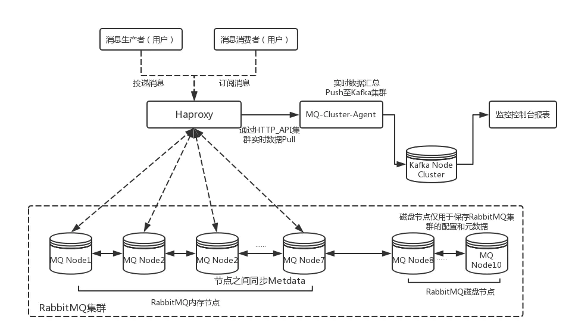
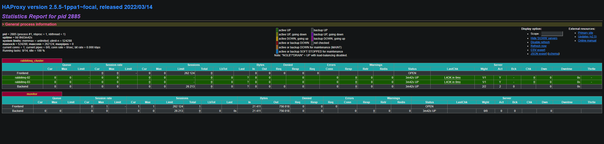
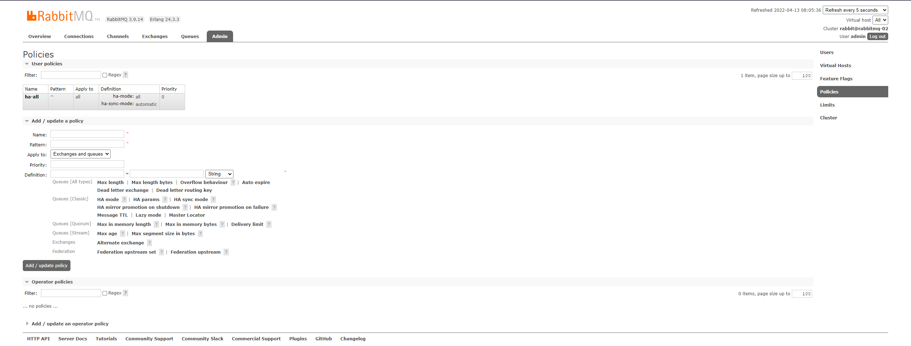

由于为了学习 RabbitMQ 的使用,我在我服务器上安装了 RabbitMQ.
目前服务器配置如下:

```json
{
    vCPU: 2核,
    RAM : 3GB,
    ROM : 50G,
    Disk Nodes: 192.168.2.30,
    RAM Nodes: [192.168.2.31, 192.168.2.32],
    haproxy: {
        vCPU: 1,
        RAM : 1GB,
        ROM : 30GB,
        IP  : 192.168.2.35
    }
}
```

- 更多的节点添加方式是一样的,这里就不再添加更多的了.
- 部署方案按照这个图来,Kafka 那边暂时不用管.(图片参考自互联网)
  

###### 安装 RabbitMQ

- 要使用RabbitMQ首先肯定需要先在服务器上安装.
- 更新软件源
```shell
sudo apt update
```
- 安装工具软件
```bash
sudo apt install curl gnupg apt-transport-https -y
```
- 查看apt版本
```bash
apt -v
```
- 此时应该注意apt的版本

**当apt版本大于1.1**:
```bash
# 添加GPG Key
curl -fsSL https://packagecloud.io/rabbitmq/rabbitmq-server/gpgkey | sudo gpg --dearmor -o /etc/apt/keyrings/rabbitmq_rabbitmq-server-archive-keyring.gpg
# 创建软件源
echo -e "deb [signed-by=/etc/apt/keyrings/rabbitmq_rabbitmq-server-archive-keyring.gpg] https://packagecloud.io/rabbitmq/rabbitmq-server/ubuntu $(lsb_release -cs) main\ndeb-src [signed-by=/etc/apt/keyrings/rabbitmq_rabbitmq-server-archive-keyring.gpg] https://packagecloud.io/rabbitmq/rabbitmq-server/ubuntu $(lsb_release -cs) main" | sudo tee /etc/apt/sources.list.d/rabbitmq-server.list
```
**当apt版本小于1.1**,这里我就不写1.1版本的处理方式了,避免有人误操作,可以按照[这个页面](https://packagecloud.io/rabbitmq/rabbitmq-server/install#manual)的内容自行添加1.1版本的

- 然后执行更新软件源以及安装所需软件包
```bash
# 更新
sudo apt update -y

## 安装Erlang软件包
sudo apt install -y erlang-base erlang-asn1 erlang-crypto erlang-eldap erlang-ftp erlang-inets erlang-mnesia erlang-os-mon erlang-parsetools erlang-public-key erlang-runtime-tools erlang-snmp erlang-ssl erlang-syntax-tools erlang-tftp erlang-tools erlang-xmerl

## 安装 rabbitmq-server 以及他的依赖包
sudo apt install rabbitmq-server -y --fix-missing
```

- 安装完成后,再执行相关命令启动,以及其他常用命令

```shell
# 启动 rabbitmq 服务
sudo service rabbitmq-server start
# 关闭 rabbitmq 服务
sudo service rabbitmq-server stop
# 重启 rabbitmq 服务
sudo service rabbitmq-server restart
# 查看 rabbitmq 状态
sudo service rabbitmq-server status
```

- 另一台服务器也使用该命令安装 RabbitMQ.
- **注意**,启动 RabbitMQ 之后要启动管理服务插件,否则 15672 管理页面无法登录

```shell
# 启用 rabbitmq_manager
sudo rabbitmq-plugins enable rabbitmq_management
```

- 由于 guest 用户默认只能在 localhost 登录，所以我们需要创建一个新的用户.

```shell
##设置账号密码
joe@rabbitmq-01:~$ sudo rabbitmqctl add_user admin 123456
Adding user "admin" ...
joe@rabbitmq-01:~$ sudo rabbitmqctl set_permissions -p / admin ".*" ".*" ".*"
Setting permissions for user "admin" in vhost "/" ...
joe@rabbitmq-01:~$ sudo rabbitmqctl set_user_tags admin administrator
Setting tags for user "admin" to [administrator] ...
```

- 到这里我们安装就完成了,并且可以通过 15672 端口访问到管理页面,并使用 admin 账户进行登录.

---

###### 添加集群

- RabbitMQ 集群之间通信确认是否可以通信,使用的是 cookie,所以需要保证所有节点的 cookie 文件中的值一样.
- 由于我们没有开通 Ubuntu 系统的 root 账户,所以我们先通过 scp 命令将 25 节点的 cookie 文件发送到用户目录.

```shell
sudo scp /var/lib/rabbitmq/.erlang.cookie joe@192.168.2.31:/home/joe/
sudo scp /var/lib/rabbitmq/.erlang.cookie joe@192.168.2.32:/home/joe/
```

- 发送成功后,登入到 31,32 服务器将该 cookie 文件覆盖到原安装的默认 cookie 文件

```shell
sudo mv ./.erlang.cookie /var/lib/rabbitmq/.erlang.cookie
```

- 完成后可以通过 cat 命令查看两个 cookie 是否一致.
- **注意**,由于我们是由 joe 账户操作的文件,所以文件所有者发生了变化.导致 RabbitMQ 无法读取.所以这里还得改一下文件的所有者.

```shell
sudo chown rabbitmq:rabbitmq /var/lib/rabbitmq/.erlang.cookie
```

- 然后配置各个节点的 hosts 文件.使其对应内容一致.

```shell
sudo nano /etc/hosts
# 根据自己的实际情况,加入如下信息
192.168.2.30 rabbitmq-01
192.168.2.31 rabbitmq-02
192.168.2.32 rabbitmq-03
```

- 调整好后逐个节点执行

```shell
sudo rabbitmq-server -detached
```

- 停止 26,28 节点的 RabbitMQ 服务.

```shell
# 停止服务
sudo rabbitmqctl stop_app
# 重置服务
sudo rabbitmqctl reset
# 加入时候设置节点为内存节点(默认加入的为磁盘节点)
sudo rabbitmqctl join_cluster rabbit@rabbitmq-01 --ram
#也通过下面方式修改的节点的类型,使用该命令前需要先停止当前节点.
sudo rabbitmqctl change_cluster_node_type disc | ram
```

- 搞好了后,即可通过管理页面查看
  

---

##### 安装 haproxy

- 首先我们根据[官方地址](https://haproxy.debian.net)来查看自己所属版本的命令,这里我是用的 Ubuntu 22.04,所以执行如下命令,来安装 haproxy

```shell
sudo apt install --no-install-recommends software-properties-common
sudo add-apt-repository ppa:vbernat/haproxy-2.6
sudo apt install haproxy=2.6.\*
```

- 等待数秒安装成功后,即可使用命令验证是否安装成功

```shell
sudo haproxy -v
```

- 若是能够输出相应的信息表示安装成功.

```text
HAProxy version 2.5.5-1ppa1~focal 2022/03/14 - https://haproxy.org/
Status: stable branch - will stop receiving fixes around Q1 2023.
Known bugs: http://www.haproxy.org/bugs/bugs-2.5.5.html
Running on: Linux 5.4.0-107-generic #121-Ubuntu SMP Thu Mar 24 16:04:27 UTC 2022 x86_64
```

- 接下来编辑 haproxy 配置信息

```shell
sudo nano /etc/haproxy/haproxy.cfg
```

- 在配置文件中加入如下信息

```cfg
#绑定配置
listen rabbitmq_cluster
        bind 0.0.0.0:5672
        #配置TCP模式
        mode tcp
        #加权轮询
        balance roundrobin
        #RabbitMQ集群节点配置,其中ip1~ip(n)为RabbitMQ集群节点ip地址
        server rabbitmq-01 192.168.2.30:5672 check inter 5000 rise 2 fall 3 weight 1
        server rabbitmq-02 192.168.2.31:5672 check inter 5000 rise 2 fall 3 weight 1
        server rabbitmq-03 192.168.2.32:5672 check inter 5000 rise 2 fall 3 weight 1

#haproxy监控页面地址
listen monitor
        bind 0.0.0.0:8100
        mode http
        option httplog
        stats enable
        stats uri /stats
        stats refresh 5s
```

- 最终该文件看起来是如下样子

```cfg
global
        log /dev/log    local0
        log /dev/log    local1 notice
        chroot /var/lib/haproxy
        stats socket /run/haproxy/admin.sock mode 660 level admin expose-fd listeners
        stats timeout 30s
        user haproxy
        group haproxy
        daemon

        # Default SSL material locations
        ca-base /etc/ssl/certs
        crt-base /etc/ssl/private

        # See: https://ssl-config.mozilla.org/#server=haproxy&server-version=2.0.3&config=intermediate
        ssl-default-bind-ciphers ECDHE-ECDSA-AES128-GCM-SHA256:ECDHE-RSA-AES128-GCM-SHA256:ECDHE-ECDSA-AES256-GCM-SHA384:ECDHE-RSA-AES256-GCM-SHA384:ECDHE-ECDSA-CHACHA20-POLY1305:ECDHE-RSA-CHACHA20-POLY1305:DHE-RSA-AES128-GCM-SHA256:DHE-RSA-AES256-GCM-SHA384
        ssl-default-bind-ciphersuites TLS_AES_128_GCM_SHA256:TLS_AES_256_GCM_SHA384:TLS_CHACHA20_POLY1305_SHA256
        ssl-default-bind-options ssl-min-ver TLSv1.2 no-tls-tickets

defaults
        log     global
        mode    http
        option  httplog
        option  dontlognull
        timeout connect 5000
        timeout client  50000
        timeout server  50000
        errorfile 400 /etc/haproxy/errors/400.http
        errorfile 403 /etc/haproxy/errors/403.http
        errorfile 408 /etc/haproxy/errors/408.http
        errorfile 500 /etc/haproxy/errors/500.http
        errorfile 502 /etc/haproxy/errors/502.http
        errorfile 503 /etc/haproxy/errors/503.http
        errorfile 504 /etc/haproxy/errors/504.http

#绑定配置
listen rabbitmq_cluster
        bind 0.0.0.0:5672
        #配置TCP模式
        mode tcp
        option  tcplog
        #加权轮询
        balance roundrobin
        #RabbitMQ集群节点配置,其中ip1~ip(n)为RabbitMQ集群节点ip地址
        server rabbitmq-01 192.168.2.30:5672 check inter 5000 rise 2 fall 3 weight 1
        server rabbitmq-02 192.168.2.31:5672 check inter 5000 rise 2 fall 3 weight 1
        server rabbitmq-03 192.168.2.32:5672 check inter 5000 rise 2 fall 3 weight 1

#haproxy监控页面地址
listen monitor
        bind 0.0.0.0:8100
        mode http
        option httplog
        stats enable
        stats uri /status
        stats refresh 5s
        # 添加验证
        stats auth admin:123456
```

- 接下来启动 haproxy 服务,以及常用命令

```shell
# 启动服务
sudo systemctl start haproxy
# 查看状态
sudo systemctl status haproxy
# 重启服务
sudo systemctl restart haproxy
# 停止服务
sudo systemctl stop haproxy
```

- 通过查看服务状态确认无异常后,即可将 haproxy 服务加入开机自启

```shell
sudo systemctl enable haproxy
```

- 在一切都完成后,我们就可以登录配置的页面查看状态, http://192.168.2.35:8100/status 由于我们配置了登录验证,输入刚才配置的账号密码(admin:123456)就可以进入页面了
  
- 使用 haproxy 做负载均衡后,为了高可用还可以再对 haproxy 进行集群,做一个主备,使用 keepalived 来进行监控做热切换,这里我们就不再深入做集群了,单节点负载均衡暂时用着.以后挂了再说.😁😁😁😁

---

##### 调整镜像模式

- 为了高可用服务,将服务设置为镜像模式.
- 参数说明

```help
rabbitmqctl set_policy [-p Vhost] Name Pattern Definition [Priority]
-p Vhost： 可选参数，针对指定vhost下的queue进行设置
Name: policy的名称
Pattern: queue的匹配模式(正则表达式)
Definition：镜像定义，包括三个部分ha-mode, ha-params, ha-sync-mode
        ha-mode:指明镜像队列的模式，有效值为 all/exactly/nodes
            all：表示在集群中所有的节点上进行镜像
            exactly：表示在指定个数的节点上进行镜像，节点的个数由ha-params指定
            nodes：表示在指定的节点上进行镜像，节点名称通过ha-params指定
        ha-params：作为参数，为ha-mode的补充
        ha-sync-mode：进行队列中消息的同步方式，有效值为automatic和manual
priority：可选参数，policy的优先级
```

- 使用命令的方式

```shell
sudo rabbitmqctl set_policy ha-all "^" '{"ha-mode":"all","ha-sync-mode":"automatic"}' --apply-to all
```

- 或者使用 web 管理页面添加.
- 首先登入 web 管理界面,点击 Admin,然后选择 Policies 按照如图显示配置.
  
