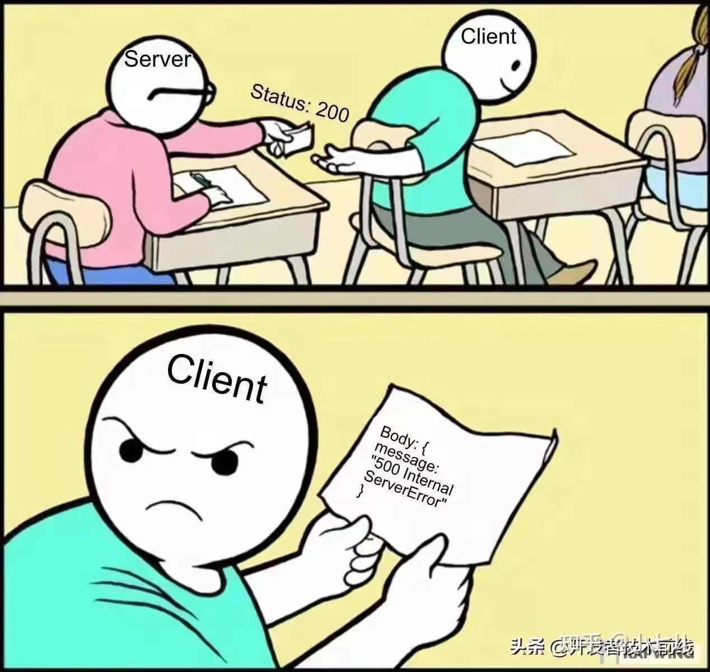

### .NET8 全局异常处理

> 异常的处理在我们应用程序中是非常重要的,在 .NET 中有很多异常处理的方式,比如 MVC 的异常筛选器,自定义中间件亦或者第三方的解决方案等.MVC 异常筛选器对管道的部分异常捕获不到,利用中间件的方式较多.


在 .NET8 发布之后支持了新的异常处理机制 IExceptionHandler 或者 UseExceptionHandler 异常处理程序的 lambda 配置,配合 ProblemDetail 使得异常处理更加规范.在官方文档中还提到一个 UseStatusCodePages 中间件,它可以为 HTTP 错误状态代码(如"404 - 未找到")提供状态代码页.这里不做过多介绍,因为本文主要使用 WebApi 来作为讲解.感兴趣的可以查阅官方文档了解更多.

- https://learn.microsoft.com/zh-cn/aspnet/core/fundamentals/error-handling?view=aspnetcore-8.0

ProblemDetail 一种计算机可读格式，用于指定基于 RFC7807 的 HTTP API 响应中的错误.

- https://tools.ietf.org/html/rfc7807

#### 添加 ProblemDetails 服务

- 一般按照常理来说,我应该创建一个新的 WebApi 项目来作为本文的例子,但是今天有点困,不想搞那么多内容.就用以前开源的项目上来直接讲解.
- 虽然是用原来的项目来讲解,但是我还是会用默认的方式来写文章,实际上我代码里会有一些差别,感兴趣的可以查看一下代码,不会的可以私信我或者留言.
- 开源项目地址: https://github.com/EasilyNET/EasilyNET

```csharp
// 添加 ProblemDetails 服务
builder.Services.AddProblemDetails();
```

- 在项目中模板代码提供了一个开发者的错误页面,这里不需要他了.直接删除或者注释掉就行.

```csharp
if (app.Environment.IsDevelopment()) app.UseDeveloperExceptionPage();
```

- 原有的 DeveloperExceptionPage 会显示完整的报错信息,可能会包含一些敏感内容(比如:授权码,许可证,数据库连接字符串等),所以非开发环境不要使用.
- 然后我们在管道最上面添加如下管道,这个可以根据自己期望的异常捕获范围调节.

```csharp
// 异常处理中间件
app.UseExceptionHandler();
```

- 到这里我们去写一个接口就可以用来测试了.

```csharp
/// <summary>
/// Error
/// </summary>
[HttpGet("Error")]
public void GetError() => throw new("给我一个大异常");
```

- 使用 Swagger 发起这个请求后,我们大概能收到这样一个回复.

```json
{
  "type": "https://tools.ietf.org/html/rfc9110#section-15.6.1",
  "title": "An error occurred while processing your request.",
  "status": 500
}
```

- 到这里第一步我们已经完成了.

#### 自定义业务异常

> 通常我们的系统中包含一些系统异常和业务异常.比如未授权,数据不存在等,系统异常则包含一些基础的工具库,或者别的一些基础环境产生的异常.可能我们需要对不同异常进行一些不同的响应.

- 我们创建一个 BusinessException 类用来表示业务异常,别的异常我也不管了.直接 Exception 抛出就行.

```csharp
/// <summary>
/// 业务异常,用于处理业务中的异常信息
/// </summary>
/// <param name="code">HTTP请求状态码</param>
/// <param name="message">消息</param>
public class BusinessException(HttpStatusCode code, string message) : Exception(message)
{
    /// <summary>
    /// HTTP状态码
    /// </summary>
    public HttpStatusCode Code { get; private set; } = code;

    /// <summary>
    /// 消息
    /// </summary>
    public new string Message { get; private set; } = message;
}
```

- 接下来我们创建一个 Handler 用于当发生 BusinessException 后的处理方式.

```csharp
/// <summary>
///     <inheritdoc cref="IExceptionHandler" />
/// </summary>
/// <param name="environment"></param>
public sealed class BusinessExceptionHandler(IHostEnvironment environment) : IExceptionHandler
{
    /// <inheritdoc cref="IExceptionHandler.TryHandleAsync" />
    public async ValueTask<bool> TryHandleAsync(HttpContext httpContext, Exception exception, CancellationToken cancellationToken)
    {
        // 当不是 BusinessException 的时候本 Handler 不处理
        if (exception is not BusinessException business) return false;
        var details = new ProblemDetails
        {
            Status = (int?)business.Code,
            Title = business.Message
        };
        // 当为开发环境的时候,可以输出一些详细的信息.
        if (environment.IsDevelopment())
        {
            details.Detail = $"""
                              {business.Source}
                              {business.StackTrace}
                              """;
        }
        httpContext.Response.StatusCode = details.Status.Value;
        await httpContext.Response.WriteAsJsonAsync(details, cancellationToken);
        return true;
    }
}
```

- 完成后在 IOC 容器中注册我们的 Handler 服务

```csharp
// 添加 ProblemDetails 服务
builder.Services.AddProblemDetails();
builder.Services.AddExceptionHandler<BusinessExceptionHandler>();
```

这里可以注册多个自定义异常处理器分别处理不同类型的异常,按默认的注册顺序来处理,如果返回 true 则会处理此异常返回 false 会跳到下一个 ExceptionHandler,没处理的异常在 UseExceptionHandler 中间件做最后处理.这里做个比喻:假设我们还有别的 XExceptionHandler,并通过下面的代码注册服务.那么会先处理 BusinessExceptionHandler 然后再处理 XExceptionHandler,最后别的异常则交给 UseExceptionHandler.

```csharp
// 添加 ProblemDetails 服务
builder.Services.AddProblemDetails();
builder.Services.AddExceptionHandler<BusinessExceptionHandler>();
// 假设还有别的 ExceptionHandler
builder.Services.AddExceptionHandler<XExceptionHandler>();
```

- 最后我们调整一下刚才的接口.然后使用 Swagger 请求一下.

```csharp
/// <summary>
/// Error
/// </summary>
[HttpGet("Error")]
public void GetError() => throw new BusinessException(HttpStatusCode.Forbidden, "403异常");
```

```json
{
  "title": "403异常",
  "status": 403,
  "detail": "WebApi.Test.Unit\r\n   at WebApi.Test.Unit.Controllers.ValuesController.GetError() in G:\\GitHub\\EasilyNET\\sample\\WebApi.Test.Unit\\Controllers\\ValuesController.cs:line 18\r\n   at Microsoft.Extensions.Internal.ObjectMethodExecutor.<>c__DisplayClass33_0.<WrapVoidMethod>b__0(Object target, Object[] parameters)\r\n   at Microsoft.AspNetCore.Mvc.Infrastructure.ActionMethodExecutor.VoidResultExecutor.Execute(ActionContext actionContext, IActionResultTypeMapper mapper, ObjectMethodExecutor executor, Object controller, Object[] arguments)\r\n   at Microsoft.AspNetCore.Mvc.Infrastructure.ControllerActionInvoker.InvokeActionMethodAsync()\r\n   at Microsoft.AspNetCore.Mvc.Infrastructure.ControllerActionInvoker.Next(State& next, Scope& scope, Object& state, Boolean& isCompleted)\r\n   at Microsoft.AspNetCore.Mvc.Infrastructure.ControllerActionInvoker.InvokeNextActionFilterAsync()\r\n--- End of stack trace from previous location ---\r\n   at Microsoft.AspNetCore.Mvc.Infrastructure.ControllerActionInvoker.Rethrow(ActionExecutedContextSealed context)\r\n   at Microsoft.AspNetCore.Mvc.Infrastructure.ControllerActionInvoker.Next(State& next, Scope& scope, Object& state, Boolean& isCompleted)\r\n   at Microsoft.AspNetCore.Mvc.Infrastructure.ControllerActionInvoker.InvokeInnerFilterAsync()\r\n--- End of stack trace from previous location ---\r\n   at Microsoft.AspNetCore.Mvc.Infrastructure.ResourceInvoker.<InvokeFilterPipelineAsync>g__Awaited|20_0(ResourceInvoker invoker, Task lastTask, State next, Scope scope, Object state, Boolean isCompleted)\r\n   at Microsoft.AspNetCore.Mvc.Infrastructure.ResourceInvoker.<InvokeAsync>g__Logged|17_1(ResourceInvoker invoker)\r\n   at Microsoft.AspNetCore.Mvc.Infrastructure.ResourceInvoker.<InvokeAsync>g__Logged|17_1(ResourceInvoker invoker)\r\n   at Microsoft.AspNetCore.Routing.EndpointMiddleware.<Invoke>g__AwaitRequestTask|7_0(Endpoint endpoint, Task requestTask, ILogger logger)\r\n   at EasilyNET.WebCore.Middleware.RepeatSubmitMiddleware.Invoke(HttpContext context) in G:\\GitHub\\EasilyNET\\src\\EasilyNET.WebCore\\Middleware\\RepeatSubmitMiddleware.cs:line 70\r\n   at Swashbuckle.AspNetCore.SwaggerUI.SwaggerUIMiddleware.Invoke(HttpContext httpContext)\r\n   at Swashbuckle.AspNetCore.Swagger.SwaggerMiddleware.Invoke(HttpContext httpContext, ISwaggerProvider swaggerProvider)\r\n   at Microsoft.AspNetCore.Authorization.AuthorizationMiddleware.Invoke(HttpContext context)\r\n   at Microsoft.AspNetCore.Authentication.AuthenticationMiddleware.Invoke(HttpContext context)\r\n   at EasilyNET.WebCore.Middleware.ResponseTimeMiddleware.Invoke(HttpContext context) in G:\\GitHub\\EasilyNET\\src\\EasilyNET.WebCore\\Middleware\\ResponseTimeMiddleware.cs:line 32\r\n   at Microsoft.AspNetCore.Diagnostics.ExceptionHandlerMiddlewareImpl.<Invoke>g__Awaited|10_0(ExceptionHandlerMiddlewareImpl middleware, HttpContext context, Task task)"
}
```

- 当为开发者环境的时候,可以看到我们输出了错误信息以及一些详细的堆栈信息.当为生产环境的时候只会得到如下内容.

```json
{
  "title": "403异常",
  "status": 403
}
```

- 到这里本文就该结束了.使用这种方案处理异常会更规范一些.

不过今天因为这个问题.讨论了一下 RESTful API 的返回数据是应该直接放到 body,并使用 HTTP 状态码来判断是否成功取到数据,还是用别的类型包一次全部返回 200.大家有兴趣的也可以思考一下和讨论一下.

这里我先把我们讨论的结果说出来,我个人认为应该使用 HTTP 状态码来判断请求是否成功,而 body 中直接返回数据.并且我看了 RESTful 的规范也是如此.因为我也做过前端开发,所以我觉得这么做很合理.最后附赠一个调侃图 😁


