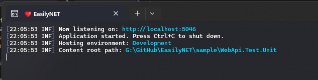
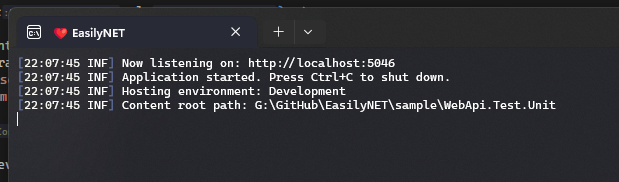
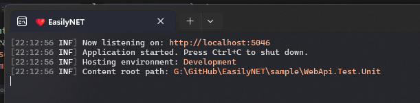
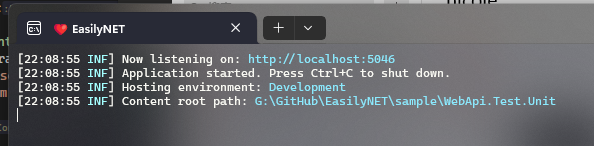
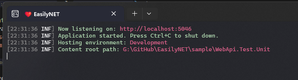

### 为 Serilog 添加 Dracula Theme 风格输出

> Serilog 是 Microsoft .NET 的结构化日志记录库,在如今.NET 平台下几乎可以说是无人不知,无人不爱.

Serilog.Sinks.Console 只有在输出到控制台的时候提供了几个默认的日志主题.包括如下几种:

- AnsiConsoleTheme.Literate: 这是一个 ANSI 256 色版本的 "literate" 主题.
- AnsiConsoleTheme.Grayscale: 这是一个 ANSI 256 色版本的 "grayscale" 主题.
- AnsiConsoleTheme.Code: 这是一个受 Visual Studio Code 启发的 ANSI 256 色主题.
- AnsiConsoleTheme.Sixteen: 这是一个适用于浅色和深色背景的 ANSI 16 色主题.

上面从 GitHub 官方介绍复制下来的.

他们的效果如下:

- Literate



- Grayscale



- Code



- Sixteen



虽然默认的主题也够用,但是我现在不是失业在家闲来无事呢,所以想着能不能给他弄一个 Dracula 主题呢?

首先我这里简单的介绍下 Dracula 主题.

> Dracula Theme 是为了最小化上下文切换而创建的,帮助您在代码语法亮和最近的 UI 组件方面实现最佳的聚焦和可读性.

官方介绍大概就是这么一句.官网上大概为 100 多种编辑器适配了配色方案,其中著名的 IDE 包括 VS,VS Code,JetBrains 全家桶,Notepad++,Microsoft Windows Terminal 等.我常用的 Notepad++ 和 Windows Terminal 都是用 Dracula 主题.所以还是比较喜欢这个主题的.

接下来回到正题.

#### 如何让 Serilog 使用上 Deracula 主题呢?

- 通过 VS+R#我通过 F12 查看了 AnsiConsoleTheme.Code 的源码

```csharp
public static AnsiConsoleTheme Code { get; } = new AnsiConsoleTheme((IReadOnlyDictionary<ConsoleThemeStyle, string>) new Dictionary<ConsoleThemeStyle, string>()
{
  [ConsoleThemeStyle.Text] = "\u001B[38;5;0253m",
  [ConsoleThemeStyle.SecondaryText] = "\u001B[38;5;0246m",
  [ConsoleThemeStyle.TertiaryText] = "\u001B[38;5;0242m",
  [ConsoleThemeStyle.Invalid] = "\u001B[33;1m",
  [ConsoleThemeStyle.Null] = "\u001B[38;5;0038m",
  [ConsoleThemeStyle.Name] = "\u001B[38;5;0081m",
  [ConsoleThemeStyle.String] = "\u001B[38;5;0216m",
  [ConsoleThemeStyle.Number] = "\u001B[38;5;151m",
  [ConsoleThemeStyle.Boolean] = "\u001B[38;5;0038m",
  [ConsoleThemeStyle.Scalar] = "\u001B[38;5;0079m",
  [ConsoleThemeStyle.LevelVerbose] = "\u001B[37m",
  [ConsoleThemeStyle.LevelDebug] = "\u001B[37m",
  [ConsoleThemeStyle.LevelInformation] = "\u001B[37;1m",
  [ConsoleThemeStyle.LevelWarning] = "\u001B[38;5;0229m",
  [ConsoleThemeStyle.LevelError] = "\u001B[38;5;0197m\u001B[48;5;0238m",
  [ConsoleThemeStyle.LevelFatal] = "\u001B[38;5;0197m\u001B[48;5;0238m"
});
```

- 看到这里一般人已经懵了,这里面的内容说实在的我也不知道啥意思,不过现在我们有 AI,遇事不决,AI 解决 😁
- 通过咨询 Microsoft Bing Copilot 得到了如下内容:

这段代码中的 \u001B[38;5;0253m 和 \u001B 后面的字符是用来控制终端文本颜色的 ANSI 转义序列。让我为您详细解释一下：

- \u001B 是 ASCII 转义字符，它表示开始一个 ANSI 转义序列。
- [38;5;0253m 是 ANSI 控制序列的一部分，用于设置文本颜色。具体来说：
  - 38 表示设置前景色（文本颜色）。
  - 5 表示使用 256 色调色板。
  - 0253 是一个颜色索引，对应于特定的颜色。

在这个例子中，\u001B[38;5;0253m 设置文本颜色为索引为 253 的颜色。不过，由于不同终端和操作系统对 ANSI 转义序列的支持可能有所不同，实际效果可能因环境而异。

- 看完这段介绍后大概的了解了其中字符串的含义.那接下来就是根据 Dracula Theme 的风格来配置一下即可.
- 不过事已至此,让我自己手动去配置肯定是有点不现实的,因为我即使是看明白了上面的 ANSI 转义序列的含义,那我也不会一个一个的手动去写那么多,还得对照 Dracula Theme 的风格来写.
- 于是我给 AI 发了一句话.让他帮我写就好了.😂
- 原本可能我自己需要几十分钟完成的内容,我在 10 秒内就得到了解决,接下来将这段代码贴上来.

```csharp
new AnsiConsoleTheme(new Dictionary<ConsoleThemeStyle, string>
{
    [ConsoleThemeStyle.Text] = "\u001B[38;5;151m",                       // Dracula Theme: Lighter gray
    [ConsoleThemeStyle.SecondaryText] = "\u001B[38;5;245m",              // Dracula Theme: Darker gray
    [ConsoleThemeStyle.TertiaryText] = "\u001B[38;5;244m",               // Dracula Theme: Even darker gray
    [ConsoleThemeStyle.Invalid] = "\u001B[38;5;214m",                    // Dracula Theme: Orange
    [ConsoleThemeStyle.Null] = "\u001B[38;5;248m",                       // Dracula Theme: Light gray
    [ConsoleThemeStyle.Name] = "\u001B[38;5;141m",                       // Dracula Theme: Pink
    [ConsoleThemeStyle.String] = "\u001B[38;5;168m",                     // Dracula Theme: Light purple
    [ConsoleThemeStyle.Number] = "\u001B[38;5;141m",                     // Dracula Theme: Pink
    [ConsoleThemeStyle.Boolean] = "\u001B[38;5;248m",                    // Dracula Theme: Light gray
    [ConsoleThemeStyle.Scalar] = "\u001B[38;5;119m",                     // Dracula Theme: Green
    [ConsoleThemeStyle.LevelVerbose] = "\u001B[37m",                     // Dracula Theme: White
    [ConsoleThemeStyle.LevelDebug] = "\u001B[37m",                       // Dracula Theme: White
    [ConsoleThemeStyle.LevelInformation] = "\u001B[37;1m",               // Dracula Theme: Bold white
    [ConsoleThemeStyle.LevelWarning] = "\u001B[38;5;208m",               // Dracula Theme: Yellow
    [ConsoleThemeStyle.LevelError] = "\u001B[38;5;197m\u001B[48;5;238m", // Dracula Theme: Red on light gray background
    [ConsoleThemeStyle.LevelFatal] = "\u001B[38;5;197m\u001B[48;5;238m"  // Dracula Theme: Red on light gray background
})
```

- 将这个代码写到我们的代码中.

```csharp
// 添加Serilog配置
builder.Host.UseSerilog((hbc, lc) =>
{
    const LogEventLevel logLevel = LogEventLevel.Information;
    lc.ReadFrom.Configuration(hbc.Configuration)
      .MinimumLevel.Override("Microsoft", logLevel)
      .MinimumLevel.Override("System", logLevel)
      .Enrich.FromLogContext()
      .WriteTo.Async(wt =>
      {
          if (hbc.HostingEnvironment.IsDevelopment())
          {
              //wt.SpectreConsole();
              wt.Debug();
              wt.Console(theme: new AnsiConsoleTheme(new Dictionary<ConsoleThemeStyle, string>
              {
                  [ConsoleThemeStyle.Text] = "\x1b[38;5;151m",                     // Dracula Theme: Lighter gray
                  [ConsoleThemeStyle.SecondaryText] = "\x1b[38;5;245m",            // Dracula Theme: Darker gray
                  [ConsoleThemeStyle.TertiaryText] = "\x1b[38;5;244m",             // Dracula Theme: Even darker gray
                  [ConsoleThemeStyle.Invalid] = "\x1b[38;5;214m",                  // Dracula Theme: Orange
                  [ConsoleThemeStyle.Null] = "\x1b[38;5;248m",                     // Dracula Theme: Light gray
                  [ConsoleThemeStyle.Name] = "\x1b[38;5;141m",                     // Dracula Theme: Pink
                  [ConsoleThemeStyle.String] = "\x1b[38;5;168m",                   // Dracula Theme: Light purple
                  [ConsoleThemeStyle.Number] = "\x1b[38;5;141m",                   // Dracula Theme: Pink
                  [ConsoleThemeStyle.Boolean] = "\x1b[38;5;248m",                  // Dracula Theme: Light gray
                  [ConsoleThemeStyle.Scalar] = "\x1b[38;5;119m",                   // Dracula Theme: Green
                  [ConsoleThemeStyle.LevelVerbose] = "\x1b[37m",                   // Dracula Theme: White
                  [ConsoleThemeStyle.LevelDebug] = "\x1b[37m",                     // Dracula Theme: White
                  [ConsoleThemeStyle.LevelInformation] = "\x1b[37;1m",             // Dracula Theme: Bold white
                  [ConsoleThemeStyle.LevelWarning] = "\x1b[38;5;208m",             // Dracula Theme: Yellow
                  [ConsoleThemeStyle.LevelError] = "\x1b[38;5;197m\x1b[48;5;238m", // Dracula Theme: Red on light gray background
                  [ConsoleThemeStyle.LevelFatal] = "\x1b[38;5;197m\x1b[48;5;238m"  // Dracula Theme: Red on light gray background
              }));
          }
          else
          {
              wt.Console(theme: AnsiConsoleTheme.Code);
          }
      });
});
```

- 不得不说微软 AI 是真的牛.接下来看看效果.



到这里我们的 Serilog 配置已经完成了.个人还是比较喜欢这种风格的主题,稍后我将提交一个 PR 到 Serilog.Sinks.Console 库中,等合并更新后,我们即可使用 AnsiConsoleTheme.Dracula 来使用了.
