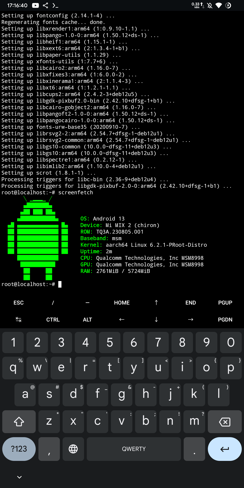
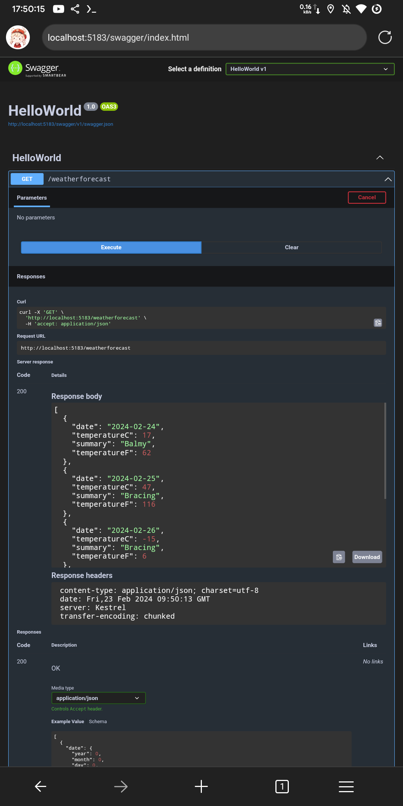

### 使用我们闲置或者不闲置的 Android 手机安装.NET

> 都 2024 年了,微软对.NET 开源已经 9 个年头了,至今甚至还有不少搞 Java 开发的人说.NET 不开源,不跨平台.这里我只能建议这些搞 Java 的人多上网看看世界.

> 自从 .NET 6 开始微软便开始提供基于 ARM64 平台的.NET SDK.所以我们可以在 Android 平台上运行 .NET 6.0 及以后的所有 .NET 版本.

别的不多说了,进入本文的正题.这个教程适合有一定 Linux 基础的人.

#### 安装 Termux

- 首先我们需要安装 Termux 这个 Android 端的终端模拟软件
- 下载地址如下: https://github.com/termux/termux-app/releases/download/v0.118.0/termux-app_v0.118.0+github-debug_arm64-v8a.apk

安装完成后我们先更新一下,执行如下命令.

```bash
pkg upgrade
```

若是出现访问速度特别慢的问题,可以更换一下清华源.

```bash
sed -i 's@^\(deb.*stable main\)$@#\1\ndeb https://mirrors.tuna.tsinghua.edu.cn/termux/apt/termux-main stable main@' $PREFIX/etc/apt/sources.list
apt update && apt upgrade
```

由于 Termux 的一些限制,导致我们在其中直接安装.NET SDK 后会存在一些依赖的包无法安装的问题,所以不能直接在 Termux 中安装.因此我们需要安装一个 Linux 的环境.

#### 安装 Linux 环境

Termux 上安装各种 Linux 系统是通过 proot-distro 工具来实现的,所以先安装一下 proot-distro 工具.

```bash
pkg install proot-distro
```

等待安装完成后,输入如下命令.查看支持的 Linux 列表

```bash
proot-distro list
```

会输出类似如下内容:

```text
Supported distributions:

  * Alpine Linux

    Alias: alpine
    Installed: no
    Comment: Rolling release branch (edge).

  * Arch Linux

    Alias: archlinux
    Installed: no
    Comment: Currently available only AArch64 and ARM ports.

  * Artix Linux

    Alias: artix
    Installed: no
    Comment: Currently available only for AArch64.

  * Debian (bookworm)

    Alias: debian
    Installed: no
    Comment: Stable release.

  * Debian (bullseye)

    Alias: debian-oldstable
    Installed: no
    Comment: Old stable release.

  * deepin

    Alias: deepin
    Installed: no
    Comment: Supports only 64-bit CPUs.

  * Fedora

    Alias: fedora
    Installed: no
    Comment: Version 39. Supports only 64-bit CPUs.

  * Manjaro

    Alias: manjaro
    Installed: no
    Comment: Currently available only for AArch64.

  * OpenKylin

    Alias: openkylin
    Installed: no
    Comment: Version 'yangtze'. Supports only 64-bit CPUs.

  * OpenSUSE

    Alias: opensuse
    Installed: no
    Comment: Rolling release (Tumbleweed).

  * Pardus

    Alias: pardus
    Installed: no
    Comment: Version 'yirmibir'. Not available for ARM 32 bit.

  * Ubuntu (23.10)

    Alias: ubuntu
    Installed: no
    Comment: Regular release (mantic). Not available for x86 32-bit (i686) CPUs.

  * Ubuntu (23.04 LTS)

    Alias: ubuntu-lts
    Installed: no
    Comment: LTS release (jammy). Not available for x86 32-bit (i686) CPUs.

  * Ubuntu (22.04 LTS)

    Alias: ubuntu-oldlts
    Installed: no
    Comment: Previous LTS release (focal). Not available for x86 32-bit (i686) CPUs.

  * Void Linux

    Alias: void
    Installed: no

Install selected one with: proot-distro install <alias>
```

根据提示信息,我们可以使用如下命令安装 Linux 环境.

```bash
proot-distro install debian
```

由于我个人更喜欢使用 Debian/Ubuntu 系统,所以这里我选择了 Debian,其他系统可以根据自己的喜好选择,后面可能会存在一些命令上的差异,请自行调整.

安装过程会持续一段时间,请耐心等待.等待安装完成后,即可进入 Linux 环境中进行操作.

```bash
prott-distro login debian
```

进入 Linux 系统环境后,我们执行如下一些操作,来安装一些常用的工具.

- 更新软件源和更新系统软件

```bash
apt update -y && apt upgrade -y
```

- 完成后我们安装一些常用的工具,如 wget,nano 等.

```bash
apt install -y nano wget screenfetch tar
```

- 等待安装完成后,我们即可用 screenfetch 命令查看系统信息.

```bash
screenfetch
```

会得到类似于如图内容:



到这里,环境基本上就准备好了.接下来就是安装 SDK 的环节了.

#### 安装 .NET SDK

.NET 9 已经发布了 Preview1 了,这里我们就用 .NET 9 来进行安装.

- 首先下载 .NET 9 的 ARM64 二进制包.虽然我们也可以用包管理器来安装,但是那也太没有难度了,这里我们选择手动安装二进制文件的方式.
- 我们从官网获取下载链接,一定别选错了,选择 ARM64 的二进制文件下载链接

```bash
wget https://download.visualstudio.microsoft.com/download/pr/e8743929-2c7b-4410-88f5-5f247040b498/ff454c589dc8d5dd9cb42e0950f34a69/dotnet-sdk-9.0.100-preview.1.24101.2-linux-arm64.tar.gz
```

- 等待下载完成后,我们创建一个文件夹并且将文件解压到该文件夹中.

```bash
mkdir -p $HOME/.dotnet && tar -zxf dotnet-sdk-9.0.100-preview.1.24101.2-linux-arm64.tar.gz -C $HOME/.dotnet
```

- 等待解压完成后,我们就可以配置环境变量,以让 shell 命令行能够识别到命令.
- 首先编辑 .bashrc 文件

```bash
nano $HOME/.bashrc
```

- 在文件末尾添加如下内容.

```bash
export DOTNET_ROOT=$HOME/.dotnet
export PATH=$PATH:$DOTNET_ROOT:$DOTNET_ROOT/tools

# 解决错误
# GC heap initialization failed with error 0x8007000E
# Failed to create CoreCLR, HRESULT: 0x8007000E
export DOTNET_GCHeapHardLimit=1C0000000
```

- 输入 CTRL+O 保存,然后输入 CTRL+X 推出 nano 编辑器
- 接着输入命令刷新环境变量

```bash
source $HOME/.bashrc
```

- 然后就可以输入 dotnet --info 查看 .NET 版本信息了.

```bash
dotnet --info
```

- 若是一切正确就会输出类似如下内容:

```text
.NET SDK:
 Version:           9.0.100-preview.1.24101.2
 Commit:            6bbd460f4d
 Workload version:  9.0.100-manifests.c840f51f

Runtime Environment:
 OS Name:     debian
 OS Version:  12
 OS Platform: Linux
 RID:         linux-arm64
 Base Path:   /root/.dotnet/sdk/9.0.100-preview.1.24101.2/

.NET workloads installed:
There are no installed workloads to display.

Host:
  Version:      9.0.0-preview.1.24080.9
  Architecture: arm64
  Commit:       1d1bf92fcf

.NET SDKs installed:
  9.0.100-preview.1.24101.2 [/root/.dotnet/sdk]

.NET runtimes installed:
  Microsoft.AspNetCore.App 9.0.0-preview.1.24081.5 [/root/.dotnet/shared/Microsoft.AspNetCore.App]
  Microsoft.NETCore.App 9.0.0-preview.1.24080.9 [/root/.dotnet/shared/Microsoft.NETCore.App]

Other architectures found:
  None

Environment variables:
  DOTNET_ROOT       [/root/.dotnet]

global.json file:
  Not found

Learn more:
  https://aka.ms/dotnet/info

Download .NET:
  https://aka.ms/dotnet/download
```

- 到此我们的.NET SDK 的安装就已经成功了.

#### 创建一个 WebAPI 项目来测试是否能够正常运行.

我们创建一个文件夹用来存放我们的工程文件.并进入该文件夹.

```bash
mkdir -p $HOME/project
cd project
```

然后我们使用 dotnet CLI 来创建一个默认的 WebAPI 项目

```bash
dotnet new webapi -n HelloWorld
```

等待创建完成后,进入项目文件夹,并启动项目.

```bash
cd HelloWorld
dotnet run
```

然后等待编译完成后,查看程序启动输出.


可以看到我这里程序运行在 5183 端口.
我们就可以在浏览器中访问 http://localhost:5183/swagger 了,并且测试了请求,可以正常工作.


若是存在 root 权限的手机,我们可以使用 ip a 命令查看本机 IP 地址.
或许可以折腾成服务器来运行.NET 项目.

从理论上来说也可以使用 Frpc 来映射本机的端口到公网服务器,这样我们的 Android 手机也可以当作服务器来运行.
到这里我们的教程就结束了,感谢大家的支持.
