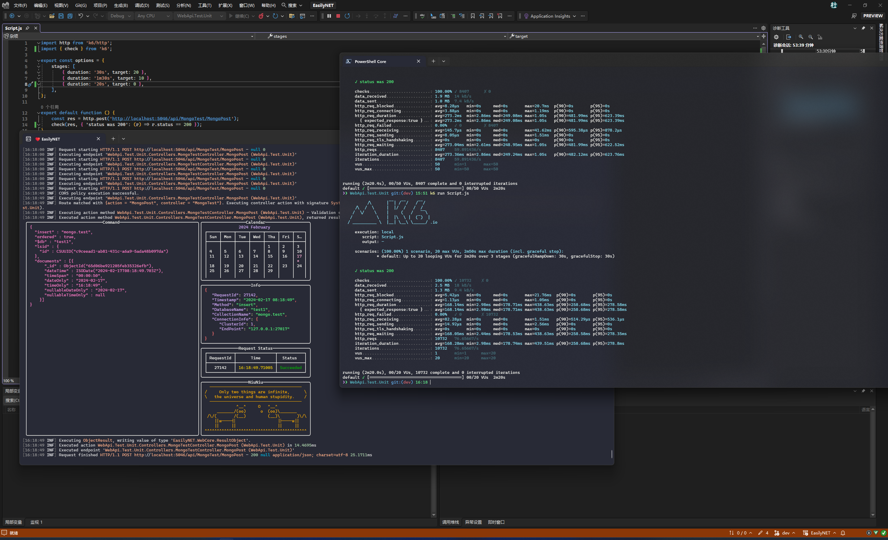

### 使用 K6 为接口进行压力测试

### 前言 (引用自网络)

负载测试,压力测试可以衡量服务是否是一个高可用,高性能的服务.负载测试能检验在不同的工作负荷下,服务的硬件消耗和响应,从而得到不同负载情况下的性能指标.压力测试能检验软硬件环境下服务所能承受的最大负荷并帮助找出系统瓶颈所在.

### K6 是什么

- Grafana k6 是一个开源负载测试工具,它使工程团队的性能测试变得简单而高效.k6 是免费,以开发人员为中心,可扩展,并且开源的.
- 使用 k6,您可以测试系统的可靠性和性能,并更早地发现性能回归和问题.k6 将帮助您构建可扩展的弹性和高性能应用程序.
- k6 由 Grafana Labs 和社区开发.
- k6 是用 Go 语言编写的一种高性能的负载测试工具.具有下面几个特点:
  - k6 嵌入了 JavaScript 运行时,可以使用 JavaScript ES2015/ES6 来编写脚本.
  - 强大的 CLI 工具.
  - 使用 Checks 和 Thresholds 可以更加轻松的做面向目标的自动化的负载测试.
  - k6 相对于 JMeter 的优势:
    - 因为 k6 是 Go 编写的,相对于 Java 编写的 JMeter 有性能上的差距,k6 可以只用较少的资源就能达到指定数量的负载.
    - 支持阈值.
    - Javascript 的脚本可以更好的促进协作和版本管理.
    - 资源利用率远远强于 JMeter.
    - 丰富的可视化方案.

### 安装 K6

> k6 包含适用于 Linux、Mac 和 Windows 的软件包.或者使用 Docker 容器或独立二进制文件.

<details> 
<summary style="font-size: 14px">Linux</summary>

#### Debian/Ubuntu

```bash
sudo gpg -k
sudo gpg --no-default-keyring --keyring /usr/share/keyrings/k6-archive-keyring.gpg --keyserver hkp://keyserver.ubuntu.com:80 --recv-keys C5AD17C747E3415A3642D57D77C6C491D6AC1D69
echo "deb [signed-by=/usr/share/keyrings/k6-archive-keyring.gpg] https://dl.k6.io/deb stable main" | sudo tee /etc/apt/sources.list.d/k6.list
sudo apt-get update
sudo apt-get install k6
```

#### Fedora/CentOS

使用 dnf 或者 yum(较旧的版本)

```bash
sudo dnf install https://dl.k6.io/rpm/repo.rpm
sudo dnf install k6
```

</details>

<details> 
<summary style="font-size: 14px">MacOS</summary>

需要使用 [Homebrew](https://brew.sh)

```bash
brew install k6
```

</details>

</details>

<details> 
<summary style="font-size: 14px">Windows</summary>

如果你使用 [Chocolate](https://chocolatey.org) 包管理器可以使用如下命令安装 K6:

```bash
choco install k6
```

若是使用 [winget](https://github.com/microsoft/winget-cli) 包管理器可以使用如下命令安装 K6:

```bash
winget install k6 --source winget
```

若是想手动安装,可以下载并运行最新的官方安装程序,下载链接: https://dl.k6.io/msi/k6-latest-amd64.msi

</details>

<details> 
<summary style="font-size: 14px">Docker</summary>

```bash
docker pull grafana/k6
```

</details>

至于二进制安装方式这里就不作介绍了,就是下载 exe 可执行程序,然后配置好环境变量.

### 使用 K6 进行压力测试

- 我们在任意位置新建一个 JavaScript 文件,我这里命名为 script.js
- 先来一个简单的例子.在这个文件中写入如下内容:

```JavaScript
import http from 'k6/http';
export const options = {
  vus: 10, // 模拟10个虚拟用户(VU) 10 virtual users
  duration: '30s', // test duration (持续压测30秒)
};
export default function () {
  http.get('http://test.k6.io'); // 接口地址 http://test.k6.io
}
// default function就相当于 C# 的Main方法,是程序的入口.
```

最后我们执行命令来启动 K6 进行压测:

<details> 
<summary style="font-size: 14px">Windows,MacOS和Linux</summary>

> 当然我们的终端路径要在 script.js 文件夹同目录,不然会找不到文件,或者在命令中指定路径.

```bash
k6 run script.js
```

- 若是我们 js 中没有写 options,也可以通过命令的方式来传入,这里不做过多介绍,个人还是喜欢写到 options

```bash
k6 run --vus 10 --duration 30s script.js
```

</details>

<details> 
<summary style="font-size: 14px">Docker</summary>

> 使用 Docker 的命令和直接在操作系统安装的方式稍有不同,我这里由于是 Windows 并且已经安装了 K6,所以并没有验证 docker 的方式,仅参考官网说明.后面不再举例 Docker 的命令.可以参考这个命令进行调整.

```bash
docker run --rm -i grafana/k6 run - <script.js
```

- 若是我们 js 中没有写 options,也可以通过命令的方式来传入,这里不做过多介绍,个人还是喜欢写到 options

```bash
docker run --rm -i grafana/k6 run --vus 10 --duration 30s - <script.js
```

</details>

同样 K6 还支持模拟更多测试阶段,测试脚本如下:

```JavaScript
import http from 'k6/http';
import { check } from 'k6';

export const options = {
  stages: [
    { duration: '30s', target: 20 },
    { duration: '1m30s', target: 10 },
    { duration: '20s', target: 0 },
  ],
};

/**
 * 上面的 options 配置了 3 个测试阶段,
 * 前30秒,用户从0增涨到20.
 * 然后接下来的1分30秒,持续模拟10个用户.
 * 然后用20秒的时间,把并发用户数从10减少到0.
*/

export default function () {
  const res = http.get('https://httpbin.test.k6.io/');
  check(res, { 'status was 200': (r) => r.status == 200 });
}
```

最后运行测试脚本,等待压测完成即可看到测试结果.

```bash
k6 run script.js
```

对于更精细的 ramp 配置,可以使用方案和执行器,可以查看官网说明: https://grafana.com/docs/k6/latest/using-k6/scenarios ,由于内容有点多,这里不做详细介绍,后面有时间的话,再结合官网例子详细介绍.

上面简单的介绍了一下基础的使用方法,接下来介绍常用的 HTTP 请求分别介绍一下.

<details> 
<summary style="font-size: 14px">GET</summary>

> Get 请求: get(url, [params])

```JavaScript
import http from 'k6/http';
export let options = {
  vus: 100, // 指定要同时运行的虚拟用户数量
  duration: '10s', // 指定测试运行的总持续时间
};
// default 默认函数
export default function () {
  // 标头
  const params = { headers: { 'Content-Type': 'application/json' } };
  const res=http.get("https://test.k6.io", params)
}
```

</details>

<details> 
<summary style="font-size: 14px">POST</summary>

> Post 请求 post(url, [body],[params])

```JavaScript
import http from 'k6/http';

const url = 'https://httpbin.test.k6.io/post';
const logoBin = open('./logo.png', 'b');

export default function () {
  let data = { name: 'Bert' };
  // 使用JSON字符串作为body
  let res = http.post(url, JSON.stringify(data), {
    headers: { 'Content-Type': 'application/json' },
  });
  console.log(res.json().json.name); // Bert

  // 使用 Object 作为 body,会自动包含'Content-Type: application/x-www-form-urlencoded'
  res = http.post(url, data);
  console.log(res.json().form.name); // Bert

  // Using a binary array as body. Make sure to open() the file as binary
  // (with the 'b' argument).
  http.post(url, logoBin, { headers: { 'Content-Type': 'image/png' } });

  // Using an ArrayBuffer as body. Make sure to pass the underlying ArrayBuffer
  // instance to http.post(), and not the TypedArray view.
  data = new Uint8Array([104, 101, 108, 108, 111]);
  http.post(url, data.buffer, { headers: { 'Content-Type': 'image/png' } });
}
```

</details>

<details> 
<summary style="font-size: 14px">DELETE</summary>

> Delete 请求 del(url, [body], [params])

```JavaScript
import http from 'k6/http';

const url = 'https://httpbin.test.k6.io/delete/{id}';

export default function () {
  const params = {
    headers: {
        'X-MyHeader': 'k6test',
        'Content-Type': 'application/json'
    }
  };
  http.del(url, null, params);
}
```

</details>

更多 HTTP 请求，可以参考官网说明：https://grafana.com/docs/k6/latest/javascript-api/k6-http

K6 还支持 WebSocket, gRPC 等多种,有需要的可以查看官网.

### 结果输出

当 k6 为您的测试生成负载时,它还会生成衡量系统性能的指标.从广义上讲,您可以通过两种方式分析指标:

- 作为汇总统计信息,在测试结束摘要报告中.
- 细粒度细节,包括测试中每个数据点(和时间戳)的测量值

也可以自定义结果输出的几乎每个方面:

- 创建自定义指标
- 配置新的汇总统计信息并将其打印为任何文本格式
- 将结果流式传输到您选择的一个或多个服务(例如: InfluxDB 或 Prometheus)

#### 指标

K6 带有有关测试负载和系统响应的内置指标.关键指标包括:

| 指标项            | 说明                           |
| ----------------- | ------------------------------ |
| http_req_duration | 所有请求的端到端时间(即总延迟) |
| http_req_failed   | 失败请求总数                   |
| iterations        | 迭代总数                       |

#### 测试摘要

> 默认情况下,k6 将汇总结果打印到标准输出,当您运行测试时,k6 会输出一个纯文本徽标,您的测试进度和一些测试详细信息. 测试完成后,k6 会打印测试指标的完整详细信息和汇总统计信息.

输出结果可以参考下图:

测试结束摘要显示结果指标的聚合统计值,包括:

- 中值和平均值
- 最小值和最大值
- P90,P95 和 P99 值
- 详细指标文档：https://grafana.com/docs/k6/latest/using-k6/metrics

#### 其他功能

- K6 还支持在网页上可视化展示测试结果,这需要注册账号.由于没有注册,所以暂时不做过多的介绍,有需要的请去官网看详细的内容.
- K6 同样也支持 Grafana 的可视化工具，这里不做过多的介绍，有需要的可以去官网看详细的内容.
