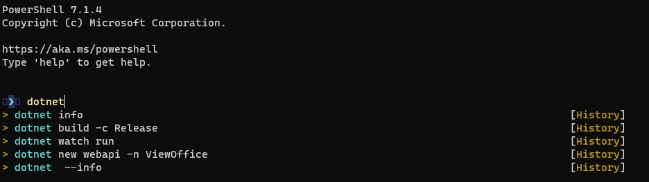

### 前置条件

- 安装[PowerShell Core](https://docs.microsoft.com/zh-cn/powershell/scripting/install/installing-powershell)
- https://docs.microsoft.com/zh-cn/powershell/scripting/install/installing-powershell
- 安装[VS Code](https://code.visualstudio.com/insiders/#)
- https://code.visualstudio.com/insiders/#
- 推荐使用 Windows Terminal 终端工具效果更好.

### 安装美化工具

- 美化 PowerShell 需要安装如下模块,这里写出他们的文档和相关网站.
- 需要[oh-my-posh](https://ohmyposh.dev/docs/),他的文档如下:
- https://ohmyposh.dev/docs
- 以及[posh-git](https://github.com/dahlbyk/posh-git)
- https://github.com/dahlbyk/posh-git

- 接下来以管理员身份打开 PowerShell, 执行

```powershell
Install-Module oh-my-posh
Install-Module posh-git
Install-Module -Name PSReadLine -AllowPrerelease -Force
```

- 这里之所以要安装预览版 PSReadLine 是因为后续的 PredictionViewStyle 选项是 2.2 之后才支持的，而目前稳定版是 2.1。 PowerShell Core 默认内置稳定版 PSReadLine, 等下个版本应该就不用手动安装 PSReadLine 了

- 配置 profile,执行 `$profile` 然后会显示 profile 文件所在路径, 一般是`%UserProfile%\Documents\PowerShell\Microsoft.PowerShell_profile.ps1`
- 然后执行`code $profile`(正式版 VSCode)或者`code-insiders $profile`(预览版 VSCode)用 vsc 打开, 如果没有就会自动创建
- 内容如下:

```powershell
Import-Module posh-git
Import-Module oh-my-posh

# 设置为 material 主题
Set-PoshPrompt -Theme material

Register-ArgumentCompleter -Native -CommandName dotnet -ScriptBlock {
    param($commandName, $wordToComplete, $cursorPosition)
        dotnet complete --position $cursorPosition "$wordToComplete" | ForEach-Object {
            [CompletionResult]::new($_, $_, 'ParameterValue', $_)
        }
}
Set-PSReadLineKeyHandler -Key "Ctrl+f" -Function ForwardWord
Set-PSReadLineKeyHandler -Key Tab -Function MenuComplete
Set-PSReadLineKeyHandler -Key "Ctrl+z" -Function Undo
Set-PSReadLineOption -PredictionSource History -PredictionViewStyle ListView
```

可以通过命令`Get-PoshThemes`获取主题列表, 然后替换里边的 material 主题即可

效果如下，按上下键切换 自动提示列表来源于历史记录

