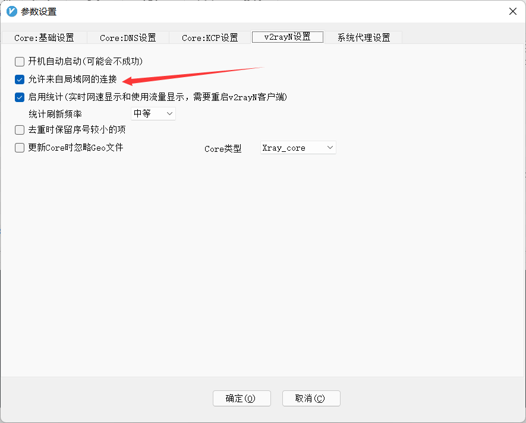
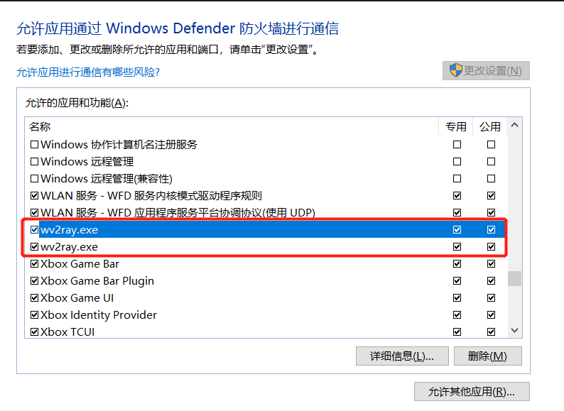

- 目标是在 WSL2 使用安装在 Win10 内的 V2R 来实现出国上网.

WSL2 获取 Win10ip
在 Win10 -> WSL2 这个方向, 是可以直接通过 Localhost 来访问的, 但是 WSL2 -> Win10 这个方向就不能直接访问 Localhost 了, 需要指定 Win10 的 ip, 想要查看 WSL2 中 Win10 的 ip, 只需要查看 **resolve.conf**

```bash
cat /etc/resolv.conf

# This file was automatically generated by WSL. To stop automatic generation of this file, add the following entry to /etc/wsl.conf:
# [network]
# generateResolvConf = false
nameserver 172.18.176.1
```

这个 172.18.176.1 就是在 WSL2 中 Win10 的 ip.
想要方便获取这个 IP, 可以直接使用下方命令 :

```shell
cat /etc/resolv.conf|grep nameserver|awk '{print $2}'
```

---

### WSL2 设置环境变量

由于上面已经可以获取到 Win10 的 ip, 这个时候就可以很方便的对各种环境变量进行设置, 因为 V2R 的默认 http 端口为 10809, socks5 端口为 10808, 所以可以直接设置环境变量 :

```shell
export windows_host=`cat /etc/resolv.conf|grep nameserver|awk '{print $2}'`
export ALL_PROXY=socks5://$windows_host:10808
export HTTP_PROXY=$ALL_PROXY
export http_proxy=$ALL_PROXY
export HTTPS_PROXY=$ALL_PROXY
export https_proxy=$ALL_PROXY
```

git 也可以设置为使用代理 :

```shell
git config --global proxy.https socks5://$windows_host:10808
```

如果想要这些环境变量和设置每次启动终端都生效, 可以在**~/.bashrc**文件最下方添加上述内容 :

```shell
export windows_host=`cat /etc/resolv.conf|grep nameserver|awk '{print $2}'`
export ALL_PROXY=socks5://$windows_host:10808
export HTTP_PROXY=$ALL_PROXY
export http_proxy=$ALL_PROXY
export HTTPS_PROXY=$ALL_PROXY
export https_proxy=$ALL_PROXY

if [ "`git config --global --get proxy.https`" != "socks5://$windows_host:10808" ]; then
            git config --global proxy.https socks5://$windows_host:10808
fi
```

---

### 设置 V2R 允许局域网连接



---

### 设置 Win10 防火墙

这一步是最重要的一步, 也是最坑的一步, 需要在 Win10 防火墙中允许 V2R 进行公用和专用网络的访问! 只要设置这个就可以了, 不需要调整过其他设置!

找到所有带 V2R 的应用的选项, 全勾上就可以了. 在 WSL2 中输入**curl -vv www.google.com**验证是否正确访问谷歌.

- 参考文章: https://jiayaoo3o.github.io/2020/06/23/%E8%AE%B0%E5%BD%95%E4%B8%80%E6%AC%A1WSL2%E7%9A%84%E7%BD%91%E7%BB%9C%E4%BB%A3%E7%90%86%E9%85%8D%E7%BD%AE/ 
